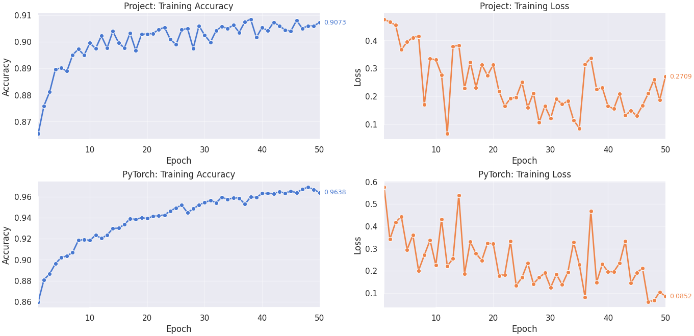

```
███╗   ██╗ ██████╗ ██╗   ██╗ █████╗ ███╗   ██╗███╗   ██╗
████╗  ██║██╔═══██╗██║   ██║██╔══██╗████╗  ██║████╗  ██║
██╔██╗ ██║██║   ██║██║   ██║███████║██╔██╗ ██║██╔██╗ ██║
██║╚██╗██║██║   ██║██║   ██║██╔══██║██║╚██╗██║██║╚██╗██║
██║ ╚████║╚██████╔╝╚██████╔╝██║  ██║██║ ╚████║██║ ╚████║
╚═╝  ╚═══╝ ╚═════╝  ╚═════╝ ╚═╝  ╚═╝╚═╝  ╚═══╝╚═╝  ╚═══╝
                NovaNN — Deep Learning Framework
```


## 🌐 Idiomas disponibles

- 🇬🇧 [English](README.en.md)
- 🇪🇸 [Español](README.md)

Este mini framework ofrece herramientas y ejemplos para la creación de redes neuronales **MLP** junto con módulos que brindan soporte y mejoran el entrenamiento de la red. Este proyecto intenta reflejar una buena comprensión y dominio sobre cómo funcionan estas redes, inspirado en cómo lo hacen los frameworks de deep learning más populares como **PyTorch** y **TensorFlow**, especialmente **PyTorch** que fue la base en la que se inspiró este proyecto.

**Aclaración**: Este mini framework busca demostrar sólidas bases y conocimientos sobre cómo funcionan las redes neuronales, Deep Learning, Machine Learning, matemáticas, ingeniería de software, buenas prácticas, tests unitarios, diseño modular y preprocesamiento de datos.

## Introducción

- Este proyecto tiene una estructura completamente **modular**; incluye un directorio llamado `examples/` con ejemplos de **clasificación binaria**, **clasificación multiclase** y **regresión** de cómo se pueden utilizar las herramientas que posee este mini framework.

- El directorio `data/` posee datasets como _Fashion-MNIST_ y _MNIST_ donde _Fashion-MNIST_ fue utilizado para comparar el rendimiento del proyecto con otro framework y _MNIST_ para realizar un ejemplo de uso normal de clasificación en el directorio `examples/`.

- Se realizó una revisión, preprocesamiento y división previa de datos en `notebooks/exploration.ipynb` donde se visualizaron los datasets y se particionó en ambos el set de validación.

- El módulo `src/` es el módulo principal que contiene todas las partes y/o herramientas que conforman este mini framework. Este posee una estructura centralizada en donde `core/config.py` almacena y carga los valores de las variables de entorno para que puedan ser asequibles por el resto de módulos, y así no tener que cargarlas en cada script.

- Se evaluó el rendimiento de **NovaNN Framework** con el popular framework de deep learning **PyTorch** en una tarea de clasificación con el dataset de _Fashion-MNIST_, en la cual se utilizó exactamente el mismo dataset e hiperparámetros para ambas pruebas. Para obtener los resultados del cotejo se guardó en formato `json` métricas como el accuracy y la pérdida.

  - **[main.py](main.py)**: Este archivo implementa el código de entrenamiento y la estructura de la red que se va a utilizar para el cotejo.
  - **[pytorch_comparison](https://colab.research.google.com/drive/1APfspox9ONmDWL0jFXmndHZ70UPjr9Mn?usp=sharing)**: En el notebook está el código de entrenamiento versión para PyTorch, que realiza el mismo procedimiento que el script.

### Resultados del cotejo:

Una vez obtenidos los resultados, se hizo un script ([visualization.py](visualization.py)) para graficar los resultados de una manera más presentable.



## 📂 Estructura del proyecto

[Structure file](FileTree_NeuralNetwork.md)

```
📁 Neural Networks
├── 📁 data
│   ├── 📁 FashionMnist
│   └── 📁 Mnist
├── 📁 examples
│   ├── 🐍 binary_classification.py
│   ├── 🐍 multiclass_classification.py
│   └── 🐍 regresion.py
├── 📁 images
│   └── 🖼️ comparison.png
├── 📁 logs
├── 📁 notebooks
│   └── 📄 exploration.ipynb
├── 📁 src
│   ├── 📁 core
│   │   ├── 🐍 __init__.py
│   │   ├── 🐍 config.py
│   │   ├── 🐍 dataloader.py
│   │   ├── 🐍 init.py
│   │   └── 🐍 logger.py
│   ├── 📁 layers
│   │   ├── 📁 activations
│   │   │   ├── 🐍 __init__.py
│   │   │   ├── 🐍 activations.py
│   │   │   ├── 🐍 relu.py
│   │   │   ├── 🐍 sigmoid.py
│   │   │   ├── 🐍 softmax.py
│   │   │   └── 🐍 tanh.py
│   │   ├── 📁 bn
│   │   │   ├── 🐍 __init__.py
│   │   │   └── 🐍 batch_normalization.py
│   │   ├── 📁 linear
│   │   │   ├── 🐍 __init__.py
│   │   │   └── 🐍 linear.py
│   │   ├── 📁 regularization
│   │   │   ├── 🐍 __init__.py
│   │   │   └── 🐍 dropout.py
│   │   └── 🐍 __init__.py
│   ├── 📁 losses
│   │   ├── 🐍 __init__.py
│   │   └── 🐍 functional.py
│   ├── 📁 metrics
│   │   ├── 🐍 __init__.py
│   │   └── 🐍 metrics.py
│   ├── 📁 model
│   │   ├── 🐍 __init__.py
│   │   └── 🐍 nn.py
│   ├── 📁 module
│   │   ├── 🐍 __init__.py
│   │   ├── 🐍 layer.py
│   │   └── 🐍 module.py
│   ├── 📁 optim
│   │   ├── 🐍 __init__.py
│   │   ├── 🐍 adam.py
│   │   ├── 🐍 rmsprop.py
│   │   └── 🐍 sgd.py
│   ├── 🐍 __init__.py
│   └── 🐍 utils.py
├── 📁 tests
│   ├── 📁 activations
│   │   ├── 🐍 test_leaky_relu.py
│   │   ├── 🐍 test_relu.py
│   │   ├── 🐍 test_sigmoid.py
│   │   ├── 🐍 test_softmax.py
│   │   └── 🐍 test_tanh.py
│   ├── 📁 batch_norm
│   │   └── 🐍 test_batch_norm.py
│   ├── 📁 dataloader
│   │   └── 🐍 test_dataloader.py
│   ├── 📁 initializers
│   │   └── 🐍 test_init.py
│   ├── 🐍 test_dropout_regularization.py
│   ├── 🐍 test_linear_layer.py
│   └── 🐍 test_sequential_module.py
├── ⚙️ .gitignore
├── 📝 FileTree_NeuralNetwork.md
├── 📝 README.en.md
├── 📝 README.es.md
├── 🐍 main.py
├── 📄 requirements.txt
└── 🐍 visualization.py
```

## Estructura del modulo `src/` y sub directorios

Aquí que se va a explicar a detalle que hace cada submodulo y sus archivos

### `core/`

**Centraliza las funciones esenciales del proyecto**

#### `config.py`

- **Propósito**: Configuraciones globales y variables de entorno
- **Variables de entorno**:
  - Rutas de datasets: `FASHION_TRAIN_DATA_PATH`, `MNIST_TRAIN_DATA_PATH`, etc.
  - Configuración de logging: `LOG_FILE`, `LOGGER_DEFAULT_FORMAT`, etc.
- **Diccionarios de inicialización**:
  - `DEFAULT_NORMAL_INIT_MAP`: Funciones de inicialización con distribución normal (Xavier/Kaiming)
  - `DEFAULT_UNIFORM_INIT_MAP`: Funciones de inicialización con distribución uniforme (Xavier/Kaiming)
  - **Claves**: Nombres de activaciones (`relu`, `leakyrelu`, `tanh`, `sigmoid`, `default`)
- **Integración con activaciones**: Las claves en los mapas de inicialización corresponden a los nombres
  de las activaciones en `layers/activations/`
- **Uso en capas lineales**: Los mapas de inicialización son utilizados por `Linear.reset_parameters()`
- **Integración completa**: Los mapas de inicialización alimentan `Linear.reset_parameters()` que crea `Parameters` objects
- **Ecosistema completo**: Los mapas de inicialización alimentan el sistema de herencia Module → Layer → Linear
- **Uso en Sequential**: Los mapas de inicialización son utilizados por `Sequential._aply_initializer_for_linear_layers()` para inicialización automática

#### `dataloader.py`

- **Clase `DataLoader`**:
  - **Propósito**: Cargador de datos iterable para mini-lotes
  - **Características**:
    - Soporta barajado (shuffle) de datos
    - Tamaño de lote configurable (`batch_size`)
    - Implementa el protocolo iterador Python
  - **Integración completa**: Utilizado en todos los ejemplos para gestión eficiente de batches
  - **Métodos principales**:
    - `__init__`: Inicializa con arrays `x` (features) e `y` (labels)
    - `__iter__`: Crea iterador para una época
    - `__len__`: Retorna número de lotes por época

#### `init.py`

- **Propósito**: Utilidades para inicialización de pesos
- **Uso en capas**: Las funciones de inicialización son utilizadas por capas lineales basándose en la activación siguiente
- **Funciones**:
  - `calculate_gain(nonlinearity, param)`: Calcula ganancia para una no linealidad
  - `xavier_normal_(shape, gain)`: Inicialización Xavier normal
  - `xavier_uniform_(shape, gain)`: Inicialización Xavier uniforme
  - `kaiming_normal_(shape, a, nonlinearity, mode)`: Inicialización Kaiming normal
  - `kaiming_uniform_(shape, a, nonlinearity, mode)`: Inicialización Kaiming uniforme
  - `random_init_(shape, gain)`: Inicialización aleatoria pequeña (default conservador)

#### `logger.py`

- **Clase `Logger`**:
  - **Propósito**: Logger personalizado con múltiples niveles
  - **Características**:
    - Logging en consola y/o archivo
    - Formateo personalizable
    - Soporte para datos adicionales via `**kwargs`
  - **Métodos**:
    - `info`, `debug`, `warning`, `error`: Logging en diferentes niveles
    - `_create_console_handler`, `_create_file_handler`: Configuran handlers
- **Instancia por defecto**: `logger` para uso global en el proyecto

### `layers/activations/`

- **Base unificada**: Todas las activaciones heredan de `Activation` que a su vez hereda de `Layer` y `Module`

#### `activations.py`

- **Clase `Activation`**:
  - **Herencia**: Subclase de `Layer`
  - **Propósito**: Clase base para todas las capas de activación
  - **Atributos**:
    - `name`: Nombre en minúsculas de la clase (identificador para mapas de inicialización)
    - `affect_init`: Booleano que indica si la activación influye en la inicialización de pesos
  - **Métodos**:
    - `get_init_key()`: Retorna la clave de inicialización si `affect_init = True`
    - `init_key`: Propiedad que alias de `get_init_key()`

#### `relu.py`

- **Clase `ReLU`**:

  - **Herencia**: Subclase de `Activation`
  - **Configuración**: `affect_init = True`
  - **Atributos**:
    - `_mask`: Máscara booleana guardada durante el forward
  - **Forward**: Aplica la función ReLU: $max(0, x)$ elemento a elemento
  - **Backward**: Retropropaga el gradiente usando la máscara: `grad * _mask`

- **Clase `LeakyReLU`**:
  - **Herencia**: Subclase de `Activation`
  - **Parámetros**:
    - `negative_slope` (por defecto 0.01): Pendiente para valores negativos
  - **Atributos**:
    - `a`: Almacena el valor de `negative_slope`
    - `activation_param`: mismo valor que `a` (para consistencia)
    - `_cache_input`: Entrada guardada para backward
  - **Forward**: Aplica `x si x >= 0, sino α * x`
  - **Backward**: Calcula `grad * np.where(x >= 0, 1.0, self.a)`

#### `sigmoid.py`

- **Clase `Sigmoid`**:
  - **Herencia**: Subclase de `Activation`
  - **Configuración**: `affect_init = True`
  - **Atributos**:
    - `out`: Salida guardada del forward para usar en backward
  - **Forward**: Calcula la función sigmoide: $\sigma(x) = \frac{1}{1 + e^{-x}}$
  - **Backward**: Calcula el gradiente: $\frac{\partial L}{\partial a} \cdot \sigma(x) \cdot (1 - \sigma(x))$

#### `softmax.py`

- **Clase `SoftMax`**:
  - **Herencia**: Subclase de `Activation`
  - **Configuración**: `affect_init = False` (no afecta inicialización)
  - **Integración con pérdidas**: Diseñada para usarse con `CrossEntropyLoss` (afect_init=False)
  - **Parámetros**:
    - `axis` (por defecto 1): Eje sobre el cual aplicar softmax
  - **Atributos**:
    - `out`: Salida guardada del forward
  - **Forward**: Calcula softmax numéricamente estable:
    $$S(z_i) = \frac{e^{z_i}}{\sum_{j=1}^K e^{z_j}}$$
  - **Backward**: Calcula el producto Jacobiano-vector:
    $$\frac{\partial S_i}{\partial z_j} = S_i(\delta_{ij} - S_j)$$

#### `tanh.py`

- **Clase `Tanh`**:
  - **Herencia**: Subclase de `Activation`
  - **Configuración**: `affect_init = True`
  - **Atributos**:
    - `out`: Salida guardada del forward para usar en backward
  - **Forward**: Calcula la función tangente hiperbólica: $\tanh(x)$
  - **Backward**: Calcula el gradiente: $\frac{\partial L}{\partial a} \cdot (1 - \tanh^2(x))$

### `layers/bn/`

#### `batch_normalization.py`

- **Clase `BatchNormalization`**:

  - **Algoritmo**: Batch Normalization (Ioffe & Szegedy, 2015)
  - **Fórmulas del Forward Pass (Modo Entrenamiento)**:

    **Estadísticas del minibatch**:
    $$\mu = \frac{1}{m} \sum_{i=1}^{m} x_i$$
    $$\sigma^2 = \frac{1}{m} \sum_{i=1}^{m} (x_i - \mu)^2$$

    **Normalización**:
    $$\hat{x}_i = \frac{x_i - \mu}{\sqrt{\sigma^2 + \epsilon}}$$

    **Escala y desplazamiento**:
    $$y_i = \gamma \hat{x}_i + \beta$$

    **Actualización de estadísticas móviles**:
    running_mean = (1 - momentum) _ running_mean + momentum _ μ
    running_var = (1 - momentum) _ running_var + momentum _ σ²

    **Fórmulas del Backward Pass**:

    **Gradientes respecto a parámetros**:
    ∂L/∂γ = Σ[i=1 to m] (∂L/∂y_i \* x̂_i)
    ∂L/∂β = Σ[i=1 to m] ∂L/∂y_i

    **Gradiente respecto a la entrada** (versión vectorizada eficiente):
    ∂L/∂x_i = (γ / (m _ √(σ² + ε))) _ (m _ ∂L/∂x̂_i - Σ[j=1 to m] ∂L/∂x̂_j - x̂_i _ Σ[j=1 to m] (∂L/∂x̂_j \* x̂_j))

    Donde:

    - ∂L/∂x̂_i = ∂L/∂y_i \* γ
    - m es el tamaño del minibatch

  - **Modo Evaluación**:
    $$\hat{x}_i = \frac{x_i - \text{running\_mean}}{\sqrt{\text{running\_var} + \epsilon}}$$
    $$y_i = \gamma \hat{x}_i + \beta$$

  - **Referencia**: Ioffe, S., & Szegedy, C. (2015). "Batch Normalization: Accelerating Deep Network Training by Reducing Internal Covariate Shift"

## **Detalles de Implementación:**

### **Estabilidad Numérica**:

- **Varianza sin bias**: Usa $\frac{m}{m-1}$ para corrección de bias en el entrenamiento
- **Épsilon**: Pequeño término $\epsilon$ para evitar división por cero

### **Cachés para Backward**:

- `x_hat`: Valores normalizados $\hat{x}_i$
- `mu`, `var`: Media y varianza del minibatch
- `x_mu`: Diferencias $x_i - \mu$

### **Propiedades Clave**:

- **Reducción de Internal Covariate Shift**: Estabiliza distribución de entradas
- **Efecto regularizador**: Reduce dependencia de Dropout
- **Permite mayores learning rates**: Entrenamiento más rápido y estable

### `layers/linear/`

#### `linear.py`

- **Clase `Linear`**:
  - **Herencia**: Subclase de `Layer`
  - **Propósito**: Capa lineal (completamente conectada) que realiza: $y = xW^T + b$
  - **Gestión de parámetros**: Utiliza `Parameters` para `weight` y `bias`, permitiendo su entrenamiento por optimizadores
  - **Integración con Sequential**: Diseñada para ser usada dentro de `Sequential` con inicialización automática
  - **Parámetros**:
    - `in_features`: Número de características de entrada
    - `out_features`: Número de características de salida
    - `bias`: Si incluye término de sesgo (por defecto `True`)
    - `init`: Función de inicialización opcional
  - **Atributos**:
    - `weight`: Parámetro de pesos con forma `(out_features, in_features)`
    - `bias`: Parámetro de sesgo con forma `(1, out_features)` (opcional)
    - `_cache_input`: Entrada guardada para cálculo de gradientes
  - **Métodos**:
    - `reset_parameters(initializer)`: (Re)inicializa pesos y sesgo
    - `forward(x)`: Calcula $x W^T + b$
    - `backward(grad)`: Calcula gradientes para pesos, sesgo y entrada
    - `parameters()`: Retorna lista de parámetros entrenables

### `layers/regularization/`

#### `dropout.py`

- **Clase `Dropout`**:
  - **Herencia**: Subclase de `Layer`
  - **Propósito**: Regularización por apagado aleatorio de neuronas
  - **Parámetros**:
    - `p`: Probabilidad de dropout (0.0 ≤ p < 1.0)
  - **Atributos**:
    - `_mask`: Máscara binaria de elementos conservados
  - **Comportamiento**:
    - **Training**: Apaga neuronas aleatoriamente y escala las restantes
    - **Evaluation**: Pasa la entrada sin cambios
  - **Métodos**:
    - `forward(x)`: Aplica dropout durante entrenamiento
    - `backward(grad)`: Propaga gradientes solo por neuronas activas

### `losses/`

#### `functional.py`

- **Clase `CrossEntropyLoss`**:

  - **Propósito**: Pérdida de entropía cruzada para clasificación multiclase
  - **Características**:
    - Espera `logits` de forma `(N, C)` y etiquetas como índices enteros `(N,)`
    - Usa softmax numéricamente estable internamente
    - Maneja tanto etiquetas one-hot como índices de clase
  - **Atributos**:
    - `y_hat`: Probabilidades softmax cacheadas
    - `y_one_hot`: Etiquetas codificadas one-hot
    - `eps`: Término de estabilidad numérica (1e-12)
  - **Métodos**:
    - `forward(logits, targets)`: Calcula pérdida y cachea valores
    - `backward()`: Retorna gradiente respecto a logits: $\frac{\partial L}{\partial z} = \frac{\hat{y} - y}{N}$
    - `__call__()`: Conveniencia para obtener pérdida y gradiente juntos

- **Clase `MSE`**:

  - **Propósito**: Error cuadrático medio para regresión
  - **Forward**: $\frac{1}{N} \sum (logits - targets)^2$
  - **Backward**: $\frac{2}{N} (logits - targets)$

- **Clase `MAE`**:

  - **Propósito**: Error absoluto medio para regresión
  - **Forward**: $\frac{1}{N} \sum |logits - targets|$
  - **Backward**: $\frac{sign(logits - targets)}{N}$

- **Clase `BinaryCrossEntropy`**:
  - **Propósito**: Entropía cruzada binaria para clasificación binaria
  - **Espera**: Probabilidades (después de sigmoid) y etiquetas 0/1
  - **Forward**: $-\frac{1}{N} \sum [y \cdot \log(p) + (1-y) \cdot \log(1-p)]$
  - **Backward**: $\frac{p - y}{N}$

### `metrics/`

#### `metrics.py`

- **Función `accuracy`**:

  - **Propósito**: Precisión para clasificación multiclase
  - **Entrada**: Modelo que retorna logits/probabilidades y DataLoader
  - **Cálculo**: $\frac{\text{predicciones correctas}}{\text{total muestras}}$
  - **Uso**: Para problemas como MNIST, Fashion-MNIST con 10 clases

- **Función `binary_accuracy`**:

  - **Propósito**: Precisión para clasificación binaria
  - **Entrada**: Modelo que retorna probabilidades [0,1] y DataLoader
  - **Umbral**: 0.5 para convertir probabilidades a clases 0/1
  - **Uso**: Para problemas binarios como make_moons

- **Función `r2_score`**:
  - **Propósito**: Coeficiente de determinación para regresión
  - **Fórmula**: $R^2 = 1 - \frac{SSE}{SST}$
  - **Interpretación**:
    - 1.0: ajuste perfecto
    - 0.0: modelo igual que la media
    - < 0.0: modelo peor que la media

### `model/`

#### `nn.py`

- **Clase `Sequential`**:
  - **Herencia**: Subclase de `Layer`
  - **Propósito**: Contenedor secuencial para capas (similar a PyTorch)
  - **Características**:
    - Inicialización automática de capas lineales basada en activaciones adyacentes
    - Gestión unificada de modos (train/eval) para todas las capas
    - Recopilación automática de parámetros
  - **Inicialización inteligente**: `Sequential` automáticamente selecciona inicializadores óptimos basándose en las activaciones cercanas a cada capa lineal
  - **Integración con `core/config.py`**: Usa `DEFAULT_NORMAL_INIT_MAP` para obtener funciones de inicialización
  - **Soporte para LeakyReLU**: Detecta el parámetro `a` y usa `kaiming_normal_` con el slope correcto
  - **Métodos**:
    - `forward(x)`: Propagación secuencial a través de todas las capas
    - `backward(grad)`: Retropropagación en orden inverso
    - `parameters()`: Todos los parámetros de todas las capas
    - `train()`/`eval()`: Configura modo para todas las capas

### `module/`

#### `module.py`

- **Clase `Parameters`**:

  - **Propósito**: Contenedor para tensores entrenables y sus gradientes
  - **Atributos**:
    - `data`: Valores actuales del parámetro
    - `grad`: Gradientes acumulados (misma forma que `data`)
    - `name`: Identificador opcional para debugging
  - **Métodos**:
    - `zero_grad(set_to_none)`: Reinicia gradientes a cero o `None`

- **Clase `Module`**:
  - **Propósito**: Clase base para todos los componentes de la red
  - **Atributos**:
    - `_training`: Flag que indica modo entrenamiento/evaluación
  - **Métodos**:
    - `train()`: Activa modo entrenamiento
    - `eval()`: Activa modo evaluación
    - `parameters()`: Retorna parámetros entrenables (vacío por defecto)
    - `zero_grad()`: Reinicia gradientes de todos los parámetros

#### `layer.py`

- **Clase `Layer`**:
  - **Herencia**: Subclase de `Module` y `ABC` (clase abstracta)
  - **Propósito**: Base abstracta para todas las capas de la red
  - **Métodos abstractos**:
    - `forward(x)`: Transformación de entrada a salida
    - `backward(grad)`: Cálculo de gradientes respecto a la entrada

### `optim/`

#### `sgd.py`

- **Clase `SGD`**:

  - **Algoritmo**: Descenso de Gradiente Estocástico con Momentum (Polyak, 1964)
  - **Fórmulas**:

    **Actualización de momentum**:
    $$v_t = \beta v_{t-1} - \eta \nabla J(\theta_t)$$

    **Actualización de parámetros**:
    $$\theta_{t+1} = \theta_t + v_t$$

    **Con weight decay L2**:
    $$\theta_{t+1} = \theta_t + v_t - \eta \lambda \theta_t$$

    **Con weight decay L1**:
    $$\theta_{t+1} = \theta_t + v_t - \eta \lambda \text{sign}(\theta_t)$$

  - **Gradient Clipping** (opcional):
    $$\text{Si } \|g\| > c, \quad g = \frac{c \cdot g}{\|g\|}$$

#### `rmsprop.py`

- **Clase `RMSprop`**:

  - **Algoritmo**: RMSprop (Hinton, 2012) - no publicado formalmente
  - **Fórmulas**:

    **Media móvil de gradientes al cuadrado**:
    $$E[g^2]_t = \beta E[g^2]_{t-1} + (1 - \beta) g_t^2$$

    **Actualización de parámetros**:
    $$\theta_{t+1} = \theta_t - \frac{\eta}{\sqrt{E[g^2]_t + \epsilon}} g_t$$

#### `adam.py`

- **Clase `Adam`**:

  - **Algoritmo**: Adam (Kingma & Ba, 2014) - "Adaptive Moment Estimation"
  - **Fórmulas**:

    **Momentos de primer y segundo orden**:
    $$m_t = \beta_1 m_{t-1} + (1 - \beta_1) g_t$$
    $$v_t = \beta_2 v_{t-1} + (1 - \beta_2) g_t^2$$

    **Corrección de bias**:
    $$\hat{m}_t = \frac{m_t}{1 - \beta_1^t}$$
    $$\hat{v}_t = \frac{v_t}{1 - \beta_2^t}$$

    **Actualización de parámetros**:
    $$\theta_{t+1} = \theta_t - \frac{\eta \cdot \hat{m}_t}{\sqrt{\hat{v}_t} + \epsilon}$$

## **Características Comunes de los Optimizadores:**

### **Weight Decay**:

- **L2 Regularization**: $\theta \leftarrow \theta - \eta \lambda \theta$
- **L1 Regularization**: $\theta \leftarrow \theta - \eta \lambda \text{sign}(\theta)$
- **Exclusión**: Parámetros `gamma`/`beta` de BatchNorm están excluidos del weight decay

### **Gradient Clipping** (SGD):

- **Propósito**: Prevenir explosión de gradientes
- **Fórmula**: $\text{clip}(g, c) = \frac{c \cdot g}{\max(\|g\|, c)}$

### **Inicialización**:

- Momentos (`velocities`, `moments`) inicializados a cero
- Contador de pasos (`t`) en Adam para corrección de bias

## 📚 **Referencias de los Algoritmos:**

1. **SGD with Momentum**: Polyak, B. T. (1964). "Some methods of speeding up the convergence of iteration methods"
2. **RMSprop**: Hinton, G. (2012). Lecture 6e of "Neural Networks for Machine Learning"
3. **Adam**: Kingma, D. P., & Ba, J. (2014). "Adam: A Method for Stochastic Optimization"

### `utils.py`

**Propósito**: Utilidades para testing de gradientes y carga de datasets

#### **Funciones de Testing de Gradientes:**

- **`numeric_grad_elementwise(act_forward, x, eps=1e-6)`**:

  - **Propósito**: Gradiente numérico elemento a elemento para funciones vectoriales
  - **Método**: Diferencias centrales
  - **Fórmula**:
    $$\frac{\partial f_i}{\partial x_j} \approx \frac{f_i(x_j + \epsilon) - f_i(x_j - \epsilon)}{2\epsilon}$$
  - **Uso**: Verificar gradientes de activaciones (ReLU, Sigmoid, Tanh)

- **`numeric_grad_scalar_from_softmax(softmax_forward, x, G, eps=1e-6)`**:

  - **Propósito**: Gradiente numérico para softmax + pérdida escalar
  - **Contexto**: $L = \sum(\text{softmax}(x) \cdot G)$
  - **Fórmula**:
    $$\frac{\partial L}{\partial x_j} \approx \frac{L(x_j + \epsilon) - L(x_j - \epsilon)}{2\epsilon}$$
  - **Uso**: Testing específico para SoftMax + CrossEntropy

- **`numeric_grad_scalar_wrt_x(forward_fn, x, G, eps=1e-6)`**:

  - **Propósito**: Gradiente numérico genérico para pérdidas escalares
  - **Contexto**: $S = \sum(\text{forward}(x) \cdot G)$
  - **Fórmula**: Similar a softmax pero para cualquier función
  - **Uso**: Testing general de capas

- **`numeric_grad_wrt_param(layer, param_attr, x, G, eps=1e-6)`**:
  - **Propósito**: Gradiente numérico respecto a parámetros de capas
  - **Contexto**: $S = \sum(\text{layer.forward}(x) \cdot G)$
  - **Fórmula**:
    $$\frac{\partial S}{\partial p_j} \approx \frac{S(p_j + \epsilon) - S(p_j - \epsilon)}{2\epsilon}$$
  - **Uso**: Verificar gradientes de pesos y biases en capas lineales

#### **Funciones de Carga de Datos:**

- **`normalize(x_data, x_mean, x_std)`**:

  - **Propósito**: Normalización estándar de datos
  - **Fórmula**:
    $$x_{\text{norm}} = \frac{x - \mu}{\sigma}$$

- **`_split_features_and_labels(df)`**:

  - **Propósito**: Separar características y etiquetas de DataFrames
  - **Lógica**:
    - Si existe columna "label" → usarla
    - Si no → primera columna son etiquetas

- **`load_fashion_mnist_data(...)`**:

  - **Propósito**: Cargar dataset Fashion-MNIST
  - **Características**:
    - Normalización opcional con estadísticas del training set
    - Usa PyArrow para eficiencia en memoria
    - Split automático en train/val/test

- **`load_mnist_data(...)`**:
  - **Propósito**: Cargar dataset MNIST clásico
  - **Mismas características** que Fashion-MNIST

## 🏗️ Arquitectura del Framework

El framework sigue una arquitectura modular inspirada en PyTorch con un sistema de herencia bien definido:

### **Sistema de Herencia Principal**

```
Module (base)
    ↳ Layer (abstracta)
        ↳ Linear, Activation, BatchNormalization, Dropout
            ↳ Activation (base para activaciones)
                ↳ ReLU, LeakyReLU, Sigmoid, SoftMax, Tanh
```

### **Flujo de Datos y Responsabilidades**

- **`Module`**: Gestión de estado (train/eval) y parámetros entrenables
- **`Layer`**: Interfaz abstracta para transformaciones (forward/backward)
- **`Parameters`**: Contenedor para datos y gradientes de parámetros
- **Capas Concretas**: Implementaciones específicas de transformaciones
- **`Losses`**: Funciones de pérdida con el mismo patrón forward/backward

### **Sistema de Inicialización Inteligente**

El framework incluye inicialización automática de parámetros:

```python
# Sequential detecta automáticamente las activaciones y elige inicializadores óptimos
model = Sequential(
    Linear(784, 256),  # Inicializado con Kaiming (por ReLU siguiente)
    ReLU(),
    Linear(256, 10)    # Inicializado con Kaiming (por ReLU anterior)
)
```

### **Sistema de Optimización**

El framework implementa optimizadores modernos con sus fórmulas originales:

- **SGD con Momentum** (Polyak, 1964): Aceleración por inercia
- **RMSprop** (Hinton, 2012): Learning rate adaptativo por parámetro
- **Adam** (Kingma & Ba, 2014): Combinación de momentum y adaptación

**Características avanzadas**:

- Weight decay (L1/L2) con exclusión automática de BatchNorm
- Gradient clipping para estabilidad numérica
- Corrección de bias en Adam (importante en primeras iteraciones)

### **Normalización por Lotes (BatchNorm)**

El framework implementa Batch Normalization según el paper original de Ioffe y Szegedy (2015):

- **Estabilización del Entrenamiento**: Reduce el internal covariate shift
- **Aceleración del Entrenamiento**: Permite usar learning rates más altos
- **Regularización Ligera**: Reduce la necesidad de Dropout

**Características avanzadas**:

- **Modos distintos**: Comportamiento diferente en entrenamiento vs evaluación
- **Estadísticas móviles**: Acumuladas durante entrenamiento para evaluación
- **Parámetros aprendibles**: `gamma` (escala) y `beta` (desplazamiento)
- **Exclusión inteligente**: Optimizadores excluyen `gamma`/`beta` del weight decay

### **Patrón de Entrenamiento Unificado**

Basado en los ejemplos reales del proyecto, el flujo de trabajo típico es:

```python
# 1. CONFIGURACIÓN DEL MODELO
model = Sequential(
    Linear(784, 256),
    BatchNormalization(256),
    ReLU(),
    Dropout(0.3),
    Linear(256, 10),
)

# 2. PREPARACIÓN DE DATOS
train_loader = DataLoader(x_train, y_train, batch_size=256, shuffle=True)
val_loader = DataLoader(x_val, y_val, batch_size=256, shuffle=False)

# 3. CONFIGURACIÓN DE ENTRENAMIENTO
model.train()  # Modo entrenamiento
optimizer = Adam(model.parameters(), learning_rate=1e-3, weight_decay=1e-4)
loss_fn = CrossEntropyLoss()

# 4. CICLO DE ENTRENAMIENTO
for epoch in range(epochs):
    for input, target in train_loader:
        # Resetear gradientes
        optimizer.zero_grad()

        # Forward pass
        output = model.forward(input)

        # Calcular pérdida
        loss, grad = loss_fn(output, target)

        # Backward pass
        model.backward(grad)

        # Actualizar parámetros
        optimizer.step()

    # Validación periódica
    model.eval()
    accuracy = accuracy(model, val_loader)
    model.train()
```

### **Patrones Específicos por Tipo de Problema**

**Clasificación Multiclase (MNIST, Fashion-MNIST)**

```python
# Arquitectura típica
Sequential(
    Linear(784, 512), BatchNormalization(512), ReLU(), Dropout(0.3),
    Linear(512, 256), BatchNormalization(256), ReLU(), Dropout(0.3),
    Linear(256, 10)  # Sin activación - logits para CrossEntropy
)
loss_fn = CrossEntropyLoss()  # Incluye SoftMax internamente
```

**Clasificación Binaria (Make Moons)**

```python
# Arquitectura típica
Sequential(
    Linear(2, 32), Tanh(), Dropout(0.2),
    Linear(32, 1), Sigmoid()  # Probabilidades para BinaryCrossEntropy
)
loss_fn = BinaryCrossEntropy()
```

**Regresión (Make Regression)**

```python
# Arquitectura típica
Sequential(
    Linear(45, 368), BatchNormalization(368), LeakyReLU(), Dropout(0.2),
    Linear(368, 176), BatchNormalization(176), LeakyReLU(), Dropout(0.4),
    Linear(176, 1)  # Salida continua
)
loss_fn = MSE()  # o MAE()
```

### **Componentes de evaluación**

```python
# Métricas por tipo de problema
accuracy(model, data_loader)           # Clasificación multiclase
binary_accuracy(model, data_loader)    # Clasificación binaria
r2_score(model, data_loader)           # Regresión
```

## 🛠️ Tecnologías utilizadas

- Lenguajes: Python 3.14.0 🐍

- Herramientas de desarrollo: Estenciones: `Black Formatter`, `FileTree Pro`

- Principales Librerias utilizadas:

1.  **`numpy`**: Arrays con opreaciones vectorizadas optimizadas en memoria.
2.  **`pandas`**: Manejo de datos tabulares. Ej. Datasets como _fashion-mnist_ y _mnist_.
3.  **`matplotlib`**: Visualización de datos y graficos estadísticos
4.  **`seaborn`**: Mejores estilos para las visualizaciones.
5.  **`scikit-learn`**: Libreria de Machine Learning clasico.
6.  **`pyarrow`**: Reducir el gran uso de memoría de pandas con datasets grandes
7.  **`pytest`**: Tests unitarios.

## 📦 Instalación

Instrucciones para instalar dependecias y preparar el entrono

1. **Clonar repositorio**

```bash
git clone https://github.com/JOSE-MDG/NovaNN.git

# Acceder al directorio
cd NovaNN
```

2. **Crear y activar un entorno virtual**

- Windows:

```bash
python -m venv .venv

# Activar entorno virtual
.\\.venv\\Scripts\\activate

# Si el anterior da problemas (PowerShell)
.\\.venv\\Scripts\\Activate.Ps1
```

- Linux/MacOS:

```bash
python -m venv .venv

# Activar entorno virtual
source .venv/bin/activate
```

3. **Instalar los requerimientos (`requirements.txt `)**

```bash
pip install -r requirements.txt
```

## 🧪 Testing (`tests/`)

El framework incluye una suite completa de tests unitarios que verifican la correcta implementación de todos los componentes:

### **Tests de Activaciones** (`tests/activations/`)

#### `test_relu.py`

- **Verifica**: Forward pass (no negatividad) y backward pass (máscara de gradiente)
- **Propiedades**: Forma de salida, comportamiento en x>0 y x<0
- **Gradientes**: Comparación analítica vs numérica para x ≠ 0

#### `test_leaky_relu.py`

- **Verifica**: Comportamiento con pendiente negativa (`negative_slope`)
- **Propiedades**: Forward (x≥0 pasa, x<0 escala) y backward (1.0 vs slope)
- **Gradientes**: Validación numérica para entradas no cero

#### `test_sigmoid.py`

- **Verifica**: Rango de salida (0,1) y cálculo de derivada
- **Propiedades**: Forma de salida y consistencia forward/backward
- **Gradientes**: Comparación σ(x)\*(1-σ(x)) vs numérico

#### `test_softmax.py`

- **Verifica**: Estabilidad numérica y propiedades de probabilidad
- **Propiedades**: Suma a 1 por fila, invariancia a desplazamiento
- **Jacobiano**: Producto Jacobiano-vector vs aproximación numérica

#### `test_tanh.py`

- **Verifica**: Rango de salida (-1,1) y propiedad de función impar
- **Propiedades**: tanh(-x) = -tanh(x), derivada 1 - tanh²(x)
- **Gradientes**: Validación numérica de la derivada

### **Tests de BatchNorm** (`tests/batch_norm/`)

#### `test_batch_norm.py`

- **Verifica**: Comportamiento en modos training/evaluation
- **Training**: Normalización correcta (media ~0, varianza acotada)
- **Evaluation**: Uso de estadísticas móviles, salidas estables
- **Propiedades**: Conservación de forma, centrado de características

### **Tests de DataLoader** (`tests/dataloader/`)

#### `test_dataloader.py`

- **Verifica**: Manejo correcto de batches, incluyendo el último batch más pequeño
- **Propiedades**: Conservación de shapes, iteración completa del dataset
- **Casos edge**: Batch_size que no divide exactamente el dataset

### **Tests de Initializers** (`tests/initializers/`)

#### `test_init.py`

- **Verifica**: Distribuciones estadísticas de los inicializadores
- **Kaiming**: Media cero, varianza apropiada para ReLU/LeakyReLU
- **Xavier**: Escalamiento correcto para tanh/sigmoid
- **Validación**: Límites de distribuciones uniformes, manejo de errores
- **Excepciones**: Nonlinearities no soportadas levantan ValueError

### **Tests de Regularización**

#### `test_dropout_regularization.py`

- **Verifica**: Comportamiento en modos training vs evaluation
- **Training**: Aplicación de máscara binaria y escalado correcto (1/(1-p))
- **Evaluation**: Paso-through sin cambios
- **Backward**: Gradientes masked y escalados idénticamente al forward

### **Tests de Capas Lineales**

#### `test_linear_layer.py`

- **Verifica**: Forward/backward de capas lineales con y sin bias
- **Shapes**: Conservación de dimensiones de entrada/salida
- **Gradientes**: Validación numérica de gradientes respecto a inputs y parámetros
- **Parámetros**: Gradientes de weight y bias vs aproximaciones numéricas

### **Tests de Módulos Secuenciales**

#### `test_sequential_module.py`

- **Verifica**: Comportamiento de contenedores Sequential
- **Forward/Backward**: Propagación a través de múltiples capas
- **Inicialización**: Detección automática de activaciones para inicializadores
- **Parámetros**: Recopilación correcta de todos los parámetros entrenables
- **Shapes**: Conservación de dimensions through the network

### **Metodología de Testing**

- **Gradientes numéricos**: Usando funciones de `utils.py` para verificar backpropagation
- **Comparación analítica**: `assert_allclose` con tolerancia 1e-5
- **Modos training/eval**: Verificación de comportamientos diferentes
- **Coverage completo**: Todos los parámetros entrenables y casos edge
- **RNG determinístico**: Para tests reproducibles

### **Ejecución de Tests**

```bash
# Ejecutar todos los tests
pytest tests/

# Ejecutar tests con output verboso
pytest tests/ -v

# Ejecutar tests específicos
pytest tests/activations/test_relu.py
pytest tests/batch_norm/ -v
```

## 🤝 Contribución

Las contribuciones son bienvenidas y apreciadas. Si deseas contribuir a NovaNN Framework, por favor sigue estos pasos:

### **¿Cómo Contribuir?**

1. **Fork del proyecto**
2. **Crea una rama para tu feature** (`git checkout -b feature/AmazingFeature`)
3. **Commit de tus cambios** (`git commit -m 'Add some AmazingFeature'`)
4. **Push a la rama** (`git push origin feature/AmazingFeature`)
5. **Abre un Pull Request**

### **Áreas de Contribución**

- 🐛 **Reporte de bugs** y issues
- 💡 **Nuevas features** y mejoras
- 📚 **Mejora de documentación**
- 🧪 **Tests adicionales**

### **Guías de Estilo**

- Sigue las convenciones de código existentes
- Incluye tests para nuevas funcionalidades
- Actualiza la documentación correspondiente

### **Reporte de Issues**

Al reportar un bug, por favor incluye:

- Versión de Python y dependencias
- Pasos para reproducir el problema
- Comportamiento esperado vs actual
- Logs relevantes si aplica

## 📄 Licencia

Este proyecto está bajo la **Licencia MIT**. Ver el archivo [LICENSE](LICENCE) para más detalles.

## 👤 Autor

Juan José - Developer, Machine & Deep Learning Enthusiast.
GitHub: https://github.com/JOSE-MDG
