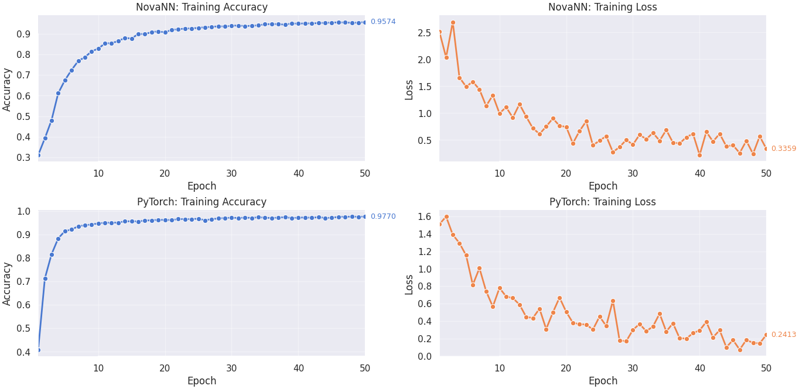

## 🌐 Idiomas disponibles

- 🇬🇧 [English](README.en.md)
- 🇪🇸 [Español](README.md)

**NovaNN** es un framework **que** ofrece herramientas y ejemplos para la creación de redes neuronales **Fully Connected** y **convolucionales** junto con módulos que brindan soporte y mejoran el entrenamiento de la red. Este proyecto **demuestra** una comprensión profunda y dominio sobre cómo funcionan estas redes, inspirado en cómo lo hacen los frameworks de deep learning más populares como **PyTorch** y **TensorFlow**, especialmente **PyTorch**, que sirvió como inspiración principal para este proyecto

**Aclaración**: Este framework fue creado con fines educativos para tener un idea clara de que hacen los grandes frameworks de Deep Learning. **Objetivo**: Demostrar conocimientos sólidos en: **redes neuronales**, **Deep Learning**, **Machine Learning**, **matemáticas**, **ingeniería de software**, **Diseño de sistemas**, **buenas prácticas**, **tests unitarios**, **diseño ultra-modular** y **preprocesamiento de datos**.

## Introducción

 **NovaNN** cuenta con una estructura completamente **modular diseñada** para que sea lo más parecido a un framework

 El directorio `data/` está destinado a datasets como _Fashion-MNIST_ y _MNIST_. Dado que los archivos originales no se incluyen en el repositorio por su tamaño, puedes descargarlos desde **Kaggle** mediante los siguientes enlaces:
  - [fasion-mnist-train](https://www.kaggle.com/datasets/zalando-research/fashionmnist?select=fashion-mnist_train.csv)
  - [fasion-mnist-test](https://www.kaggle.com/datasets/zalando-research/fashionmnist?select=fashion-mnist_test.csv)
  - [mnist-train](https://www.kaggle.com/datasets/oddrationale/mnist-in-csv?select=mnist_train.csv)
  - [mnist-test](https://www.kaggle.com/datasets/oddrationale/mnist-in-csv?select=mnist_test.csv)
 

 El directorio `examples/` contiene scripts de ejemplos como **clasificación binaria**, **clasificación multiclase**, **regresión** y **capas convolucionales**.

 En `notebooks/` encontrarás un cuaderno de Jupyter que prepara los datos de validación a partir de los datasets descargados.
 **Nota importante**: Verifica la estructura de los datos antes de ejecutar el notebook, ya que variaciones en el formato pueden causar errores.

 También es **necesario crear un archivo `.env`** con las siguientes variables de entorno:

 - **FASHION_TRAIN_DATA_PATH**: Ruta de datos de entrenamiento
 - **EXPORTATION_FASHION_TRAIN_DATA_PATH**: Ruta de datos de entrenamiento separado de los datos de validación.
 - **FASHION_VALIDATION_DATA_PATH**: Ruta de datos de validación separados de los de entrenamiento. 
 - **FASHION_TEST_DATA_PATH**: Ruta de los datos de prueba

 - **MNIST_TRAIN_DATA_PATH**: Ruta de datos de entrenamiento
 - **EXPORTATION_MNIST_TRAIN_DATA_PATH**: Ruta de datos de entrenamiento separado de los datos de validación.
 - **MNIST_VALIDATION_DATA_PATH**: Ruta de datos de validación separados de los de entrenamiento. 
 - **MNIST_TEST_DATA_PATH**: Ruta de los datos de prueba

 - **LOG_FILE**: Ruta del archivo de logs
 - **LOGGER_DEFAULT_FORMAT**: `%(asctime)s | %(levelname)-8s | %(name)s:%(funcName)s - %(message)s` <- Valor por defecto. 
 - **LOGGER_DATE_FORMAT** `%Y-%m-%d %H:%M:%S` <- Valor por defecto.

 - **Comparación con PyTorch**: Se evaluó el rendimiento de **NovaNN** frente al framework **PyTorch** en una tarea de clasificación con el dataset de _MNIST_, utilizando el mismo dataset e hiperparámetros en ambas implementaciones. Para obtener los resultados del cotejo se guardó en formato `json` métricas como el accuracy y la pérdida.

 - **[main.py](main.py)**: Este archivo implementa el código de entrenamiento y la estructura de la red que se va a utilizar para el cotejo.
 - **[cloab](https://colab.research.google.com/drive/1M6Qo2vu4mjVJWQGBK6I4PFBvwwXbQvvj?usp=sharing)**: En el notebook está el código de entrenamiento versión para PyTorch, que realiza el mismo procedimiento que el script.

### Resultados del cotejo:

Una vez obtenidos los resultados, se hizo un script ([visualization](./novann/utils/visualizations/visualization.py)) para graficar los resultados de una manera más presentable.



## 📂 Estructura del proyecto

[NovaNN Structure](./NovaNNFiletree.md)

```
📁 NovaNN
├── 📁 data
│   ├── 📁 FashionMnist
│   │   └── .gitkeep
│   └── 📁 Mnist
│       └── .gitkeep
├── 📁 examples
│   ├── 🐍 binary_classification.py
│   ├── 🐍 conv_example.py
│   ├── 🐍 multiclass_classification.py
│   └── 🐍 regresion.py
├── 📁 images
│   └── 🖼️ metrics.png
├── 📁 notebooks
│   └── 📄 exploration.ipynb
├── 📁 novann
│   ├── 📁 _typing
│   │   ├── 🐍 __init__.py
│   │   └── 🐍 _typing.py
│   ├── 📁 core
│   │   ├── 🐍 __init__.py
│   │   ├── 🐍 config.py
│   │   ├── 🐍 constants.py
│   │   └── 🐍 init.py
│   ├── 📁 layers
│   │   ├── 📁 activations
│   │   │   ├── 🐍 __init__.py
│   │   │   ├── 🐍 activations.py
│   │   │   ├── 🐍 relu.py
│   │   │   ├── 🐍 sigmoid.py
│   │   │   ├── 🐍 softmax.py
│   │   │   └── 🐍 tanh.py
│   │   ├── 📁 bn
│   │   │   ├── 🐍 __init__.py
│   │   │   ├── 🐍 batchnorm1d.py
│   │   │   └── 🐍 batchnorm2d.py
│   │   ├── 📁 convolutional
│   │   │   ├── 🐍 __init__.py
│   │   │   ├── 🐍 conv1d.py
│   │   │   └── 🐍 conv2d.py
│   │   ├── 📁 flatten
│   │   │   ├── 🐍 __init__.py
│   │   │   └── 🐍 flatten.py
│   │   ├── 📁 linear
│   │   │   ├── 🐍 __init__.py
│   │   │   └── 🐍 linear.py
│   │   ├── 📁 pooling
│   │   │   ├── 📁 gap
│   │   │   │   ├── 🐍 __init__.py
│   │   │   │   ├── 🐍 global_avg_pool1d.py
│   │   │   │   └── 🐍 global_avg_pool2d.py
│   │   │   ├── 📁 maxpool
│   │   │   │   ├── 🐍 __init__.py
│   │   │   │   ├── 🐍 maxpool1d.py
│   │   │   │   └── 🐍 maxpool2d.py
│   │   │   └── 🐍 __init__.py
│   │   ├── 📁 regularization
│   │   │   ├── 🐍 __init__.py
│   │   │   └── 🐍 dropout.py
│   │   └── 🐍 __init__.py
│   ├── 📁 losses
│   │   ├── 🐍 __init__.py
│   │   └── 🐍 functional.py
│   ├── 📁 metrics
│   │   ├── 🐍 __init__.py
│   │   └── 🐍 metrics.py
│   ├── 📁 model
│   │   ├── 🐍 __init__.py
│   │   └── 🐍 nn.py
│   ├── 📁 module
│   │   ├── 🐍 __init__.py
│   │   ├── 🐍 layer.py
│   │   └── 🐍 module.py
│   ├── 📁 optim
│   │   ├── 🐍 __init__.py
│   │   ├── 🐍 adam.py
│   │   ├── 🐍 rmsprop.py
│   │   └── 🐍 sgd.py
│   ├── 📁 utils
│   │   ├── 📁 decorators
│   │   │   ├── 🐍 __init__.py
│   │   │   └── 🐍 timing.py
│   │   ├── 📁 gradient_checking
│   │   │   ├── 🐍 __init__.py
│   │   │   └── 🐍 numerical.py
│   │   ├── 📁 log_config
│   │   │   ├── 🐍 __init__.py
│   │   │   └── 🐍 logger.py
│   │   ├── 📁 train
│   │   │   ├── 🐍 __init__.py
│   │   │   └── 🐍 train.py
│   │   ├── 📁 visualizations
│   │   │   └── 🐍 visualization.py
│   │   └── 🐍 __init__.py
│   └── 🐍 __init__.py
├── 📁 tests
│   ├── 📁 initializers
│   │   └── 🐍 test_init.py
│   ├── 📁 layers
│   │   ├── 📁 activations
│   │   │   ├── 🐍 test_leaky_relu.py
│   │   │   ├── 🐍 test_relu.py
│   │   │   ├── 🐍 test_sigmoid.py
│   │   │   ├── 🐍 test_softmax.py
│   │   │   └── 🐍 test_tanh.py
│   │   ├── 📁 batch_norm
│   │   │   ├── 🐍 test_batchnorm1d.py
│   │   │   └── 🐍 test_batchnorm2d.py
│   │   ├── 📁 conv
│   │   │   ├── 🐍 test_conv1d.py
│   │   │   └── 🐍 test_conv2d.py
│   │   ├── 📁 linear
│   │   │   └── 🐍 test_linear.py
│   │   ├── 📁 pooling
│   │   │   ├── 📁 gap
│   │   │   │   ├── 🐍 test_gap1d.py
│   │   │   │   └── 🐍 test_gap2d.py
│   │   │   └── 📁 maxpool
│   │   │       ├── 🐍 test_maxpooling1d.py
│   │   │       └── 🐍 test_maxpooling2d.py
│   │   └── 📁 regularization
│   │       └── 🐍 test_dropout.py
│   ├── 📁 optimizers
│   │   ├── 🐍 test_adam.py
│   │   ├── 🐍 test_rmsprop.py
│   │   └── 🐍 test_sgd.py
│   ├── 📁 sequential
│   │   └── 🐍 test_sequential.py
│   ├── 📝 README.en.md
│   └── 📝 README.md
├── ⚙️ .gitignore
├── 📄 LICENCE
├── 📝 NovaNNFiletree.md
├── 📝 README.en.md
├── 📝 README.md
├── 🐍 main.py
├── 📄 poetry.lock
└── ⚙️ pyproject.toml
```

## Estructura del modulo `novann/` y sub directorios

Aquí que se va a explicar a detalle que hace cada submodulo y sus

### `📂 _typing/`

**Definiciones de tipos para el sistema de tipado estático**

Contiene:
- `_typing.py`: Tipos personalizados para tensores, inicializadores, parámetros, etc.

#### `_typing.py`

- **Propósito**: Definiciones de tipos (type hints) para todo el framework
- **Tipos principales**:
  - `Shape`: Forma de tensores (tupla de enteros)
  - `InitFn`: Firma de función de inicialización de pesos
  - `ListOfParameters`: Lista de parámetros entrenables
  - `IntOrPair`: Entero o tupla para dimensiones flexibles
  - `KernelSize`, `Stride`, `Padding`: Tipos para capas convolucionales
  - `Optimizer`: Alias para optimizadores (Adam, SGD, RMSprop)
  - `LossFunc`: Alias para funciones de pérdida
  - `Loader`: Tipo para dataloaders iterables
- **Uso en el framework**: Estos tipos son importados por todos los módulos para anotaciones de tipo consistentes
- **Conexiones**:
  - `InitFn` es utilizado por `config.py` para los mapas de inicialización
  - `ListOfParameters` es usado por las capas que retornan parametros entreneables
  - Los tipos convolucionales son usados por `Conv1d`, `Conv2d`, `MaxPool`, etc.


### `📂 core/`

**Configuración global, inicialización de pesos y constantes del framework**

Contiene:
- `config.py`: Mapas de inicialización de pesos basados en activaciones
- `init.py`: Funciones de inicialización (Xavier, Kaiming, random)
- `constants.py`: Variables de entorno y rutas de datasets

#### `config.py`

- **Propósito**: Configuración centralizada de inicialización de pesos para el framework
- **Diccionarios de inicialización**:
  - `DEFAULT_NORMAL_INIT_MAP`: Mapeo de funciones de inicialización con distribución normal para diferentes funciones de activación
  - `DEFAULT_UNIFORM_INIT_MAP`: Mapeo de funciones de inicialización con distribución uniforme para diferentes funciones de activación
- **Claves soportadas**: `relu`, `leakyrelu`, `tanh`, `sigmoid`, `default` (para inicialización por defecto)
- **Integración con `core/init.py`**: Utiliza las funciones de inicialización (`kaiming_normal_`, `kaiming_uniform_`, `xavier_normal_`, `xavier_uniform_`, `random_init_`) y `calculate_gain` para calcular ganancias apropiadas
- **Uso en capas lineales**: Los mapas son utilizados por `Linear.reset_parameters()` para inicializar pesos y sesgos basándose en la activación adyacente
- **Uso en capas convolucionales**: También empleados por `Conv1d` y `Conv2d` para inicializar kernels convolucionales siguiendo el mismo principio
- **Uso en Sequential**: El contenedor `Sequential` utiliza estos mapas para inicialización automática de capas lineales y convolucionales en función de las activaciones circundantes
- **Detalles por activación**:
  - **ReLU**: Inicialización Kaiming normal/uniforme con `a=0.0`
  - **LeakyReLU**: Inicialización Kaiming normal/uniforme con `a=0.01` (pendiente negativa)
  - **Tanh**: Inicialización Xavier normal/uniforme con ganancia calculada para tanh
  - **Sigmoid**: Inicialización Xavier normal/uniforme con ganancia calculada para sigmoid
  - **Default**: Inicialización aleatoria pequeña (conservadora) para casos no especificados


#### `init.py`

- **Propósito**: Funciones de inicialización de pesos (Xavier/Glorot, Kaiming/He y aleatoria)
- **Uso en capas**: Utilizadas por capas lineales y convolucionales basándose en la activación siguiente
- **Funciones**:
  - `calculate_gain(nonlinearity, param)`: Calcula ganancia para activaciones
  - `xavier_normal_(shape, gain)`: Inicialización Xavier normal
  - `xavier_uniform_(shape, gain)`: Inicialización Xavier uniforme
  - `kaiming_normal_(shape, a, nonlinearity, mode)`: Inicialización Kaiming normal
  - `kaiming_uniform_(shape, a, nonlinearity, mode)`: Inicialización Kaiming uniforme
  - `random_init_(shape, gain)`: Inicialización aleatoria pequeña (default conservador)
- **Integración con `config.py`**: Estas funciones son mapeadas por `DEFAULT_NORMAL_INIT_MAP` y `DEFAULT_UNIFORM_INIT_MAP`

#### `constants.py`

- **Propósito**: Variables de configuración global desde archivo `.env`
- **Contenido**:
  - Rutas de datasets Fashion-MNIST y MNIST
  - Configuración de logging (archivo, formato, nivel)
- **Uso en el framework**: Importadas por otros módulos para acceso a configuración


### `📂 layers/`

**Implementaciones de todas las capas de red neuronal (lineales, convolucionales, pooling, normalización, activaciones y regularización)**

Contiene subdirectorios organizados por tipo de capa:
- `activations/`: Funciones de activación (ReLU, Sigmoid, Tanh, Softmax)
- `linear/`: Capas lineales (fully connected)
- `convolutional/`: Capas convolucionales 1D y 2D
- `pooling/`: Capas de pooling (MaxPool, GlobalAvgPool)
- `bn/`: Normalización por lotes (BatchNorm)
- `regularization/`: Regularización (Dropout)
- `flatten/`: Capa para aplanar tensores

Todas las capas heredan de `Layer` y siguen la interfaz forward/backward estándar.

#### `📂 layers/📂 activations/`

**Clases base e implementaciones de funciones de activación**

Contiene:
- `activations.py`: Clase base `Activation` para todas las activaciones
- `relu.py`: Implementaciones de `ReLU` y `LeakyReLU`
- `sigmoid.py`: Implementación de `Sigmoid`
- `softmax.py`: Implementación de `Softmax`
- `tanh.py`: Implementación de `Tanh`

##### `activations.py`

- **Propósito**: Clase base para todas las capas de activación
- **Clase principal**: `Activation` (hereda de `Layer`)
- **Atributos**:
  - `name`: Nombre en minúsculas de la clase (identificador para mapas de inicialización)
  - `affect_init`: Booleano que indica si la activación influye en la inicialización de pesos
- **Métodos**:
  - `get_init_key()`: Retorna la clave de inicialización si `affect_init = True`
  - `init_key`: Propiedad que es alias de `get_init_key()`
- **Conexiones**:
  - Hereda de `Layer` (`novann.module.layer`)
  - Usado por todas las activaciones concretas (ReLU, Sigmoid, etc.)
  - El atributo `affect_init` y `get_init_key()` son utilizados por `Sequential` para inicialización automática basada en activaciones

##### `relu.py`

- **Propósito**: Implementaciones de ReLU y LeakyReLU
- **Clases**:
  - `ReLU`: Rectified Linear Unit (max(0, x))
  - `LeakyReLU`: Leaky ReLU con pendiente negativa configurable
- **Atributos**:
  - `ReLU._mask`: Máscara booleana guardada durante el forward (x > 0)
  - `LeakyReLU.a`: Pendiente negativa para valores negativos
  - `LeakyReLU.activation_param`: Almacena el mismo valor que `a` (para consistencia)
  - `LeakyReLU._cache_input`: Entrada guardada para backward
- **Conexiones**:
  - Ambas clases heredan de `Activation`
  - `affect_init = True` en ambas, por lo que influyen en la inicialización de pesos
  - Utilizan `kaiming_normal_`/`kaiming_uniform_` de `config.py` para inicialización (mapeadas por `relu` y `leakyrelu`)
- **Implementación**:
  - `ReLU.forward`: Aplica `max(0, x)` y guarda máscara
  - `ReLU.backward`: Propaga gradientes solo donde la entrada fue > 0
  - `LeakyReLU.forward`: Aplica `x si x >= 0, sino a * x`
  - `LeakyReLU.backward`: Gradiente es `1.0` para x ≥ 0, `a` para x < 0

##### `sigmoid.py`

- **Propósito**: Implementación de la función sigmoide
- **Clase**: `Sigmoid` (hereda de `Activation`)
- **Atributos**:
  - `out`: Salida guardada del forward para usar en backward
  - `affect_init = True`: Afecta la inicialización de pesos
- **Conexiones**:
  - Usa `xavier_normal_`/`xavier_uniform_` de `config.py` para inicialización (mapeada por `sigmoid`)
  - Utiliza ganancia calculada por `calculate_gain` de `init.py`
- **Implementación**:
  - `forward`: Calcula `1 / (1 + exp(-x))` y guarda en `out`
  - `backward`: Calcula gradiente usando `out * (1 - out)`

##### `softmax.py`

- **Propósito**: Implementación de softmax numéricamente estable
- **Clase**: `Softmax` (hereda de `Activation`)
- **Atributos**:
  - `axis`: Eje sobre el cual aplicar softmax (por defecto 1)
  - `out`: Salida guardada del forward
  - `affect_init = False`: No afecta la inicialización de pesos (diseñada para usarse con `CrossEntropyLoss`)
- **Conexiones**:
  - Normalmente se usa con `CrossEntropyLoss` que combina softmax y pérdida
  - No tiene entrada en los mapas de inicialización de `config.py`
- **Implementación**:
  - `forward`: Softmax numéricamente estable (resta máximo antes de exponenciar)
  - `backward`: Calcula producto Jacobiano-vector eficiente usando salida cacheada

##### `tanh.py`

- **Propósito**: Implementación de tangente hiperbólica
- **Clase**: `Tanh` (hereda de `Activation`)
- **Atributos**:
  - `out`: Salida guardada del forward para usar en backward
  - `affect_init = True`: Afecta la inicialización de pesos
- **Conexiones**:
  - Usa `xavier_normal_`/`xavier_uniform_` de `config.py` para inicialización (mapeada por `tanh`)
  - Utiliza ganancia calculada por `calculate_gain` de `init.py`
- **Implementación**:
  - `forward`: Calcula `tanh(x)` y guarda en `out`
  - `backward`: Calcula gradiente usando `1 - tanh(x)^2`

#### `📂 layers/📂 bn/`

**Implementaciones de Batch Normalization para diferentes dimensiones de entrada**

Contiene:
- `batchnorm1d.py`: Batch Normalization para entradas 1D/2D (fully connected y convoluciones 1D)
- `batchnorm2d.py`: Batch Normalization para entradas 2D convolucionales (4D tensores)

##### `batchnorm1d.py`

- **Propósito**: Implementación de Batch Normalization para entradas 1D/2D, compatible con capas fully connected y convoluciones 1D
- **Clase principal**: `BatchNorm1d`
- **Características principales**:
  - Soporte para entradas 2D `(batch, features)` y 3D `(batch, channels, sequence_length)`
  - Modos distintos para entrenamiento (estadísticas del batch) y evaluación (estadísticas móviles)
  - Parámetros aprendibles `gamma` (escala) y `beta` (desplazamiento) con inicialización por defecto (1s y 0s)
  - Término de estabilidad numérica `eps` y corrección de Bessel para varianza insesgada
  - Momentum configurable para actualización de estadísticas móviles
- **Integración**:
  - Hereda de `Layer` de `novann.module`
  - Utiliza `Parameters` de `novann.module` para los parámetros entrenables `gamma` y `beta`
  - Usa `ListOfParameters` de `novann._typing` para el retorno de parámetros
  - Los parámetros `gamma` y `beta` son excluidos automáticamente del weight decay en optimizadores
- **Uso en el framework**:
  - Después de capas `Linear` en redes fully connected para estabilizar activaciones
  - Después de capas `Conv1d` en redes convolucionales 1D para normalización por canal
- **Detalles técnicos**:
  - **Algoritmo (Training Mode)**:

    **Cálculo de estadísticas del batch**:
    
    $$\mu = \frac{1}{m} \sum_{i=1}^{m} x_i$$
    
    $$\sigma^2 = \frac{1}{m} \sum_{i=1}^{m} (x_i - \mu)^2$$

    **Corrección de Bessel (varianza insesgada)**:
    
    $$\sigma_{\text{unbiased}}^2 = \sigma^2 \cdot \frac{m}{m - 1} \quad \text{(si } m > 1\text{)}$$

    **Normalización**:
    
    $$\hat{x}_i = \frac{x_i - \mu}{\sqrt{\sigma_{\text{unbiased}}^2 + \epsilon}}$$

    **Escala y desplazamiento**:
    
    $$y_i = \gamma \hat{x}_i + \beta$$

    **Actualización de estadísticas móviles**:
    
    $$\text{running\_mean} = (1 - \text{momentum}) \cdot \text{running\_mean} + \text{momentum} \cdot \mu$$
    
    $$\text{running\_var} = (1 - \text{momentum}) \cdot \text{running\_var} + \text{momentum} \cdot \sigma_{\text{unbiased}}^2$$

  - **Algoritmo (Evaluation Mode)**:

    **Normalización con estadísticas móviles**:
    
    $$\hat{x}_i = \frac{x_i - \text{running\_mean}}{\sqrt{\text{running\_var} + \epsilon}}$$
    
    $$y_i = \gamma \hat{x}_i + \beta$$

  - **Backward Pass**:

    **Gradientes de parámetros**:
    
    $$\frac{\partial L}{\partial \gamma} = \sum_{i=1}^{m} \frac{\partial L}{\partial y_i} \cdot \hat{x}_i$$
    
    $$\frac{\partial L}{\partial \beta} = \sum_{i=1}^{m} \frac{\partial L}{\partial y_i}$$

    **Gradiente respecto a la entrada** (versión vectorizada eficiente):
    
    $$\frac{\partial L}{\partial x_i} = \frac{\gamma}{m \sqrt{\sigma^2 + \epsilon}} \left( m \cdot \frac{\partial L}{\partial \hat{x}_i} - \sum_{j=1}^{m} \frac{\partial L}{\partial \hat{x}_j} - \hat{x}_i \sum_{j=1}^{m} \frac{\partial L}{\partial \hat{x}_j} \hat{x}_j \right)$$

  - **Manejo de dimensiones**:
    - **2D inputs**: Ejes de reducción = `(0,)` (batch)
    - **3D inputs**: Ejes de reducción = `(0, 2)` (batch y sequence)

##### `batchnorm2d.py`

- **Propósito**: Implementación de Batch Normalization para entradas 2D convolucionales (tensores 4D)
- **Clase principal**: `BatchNorm2d`
- **Características principales**:
  - Diseñado específicamente para tensores 4D `(batch, channels, height, width)`
  - Normalización por canal sobre dimensiones espaciales y de batch
  - Parámetros `gamma` y `beta` con forma `[1, channels, 1, 1]` para broadcasting
  - Modos training/evaluation con comportamiento diferenciado
- **Integración**:
  - Hereda de `Layer` de `novann.module`
  - Utiliza `Parameters` para `gamma` y `beta` con shape adaptado a tensores 4D
  - Compatible con capas `Conv2d` para redes convolucionales 2D
- **Uso en el framework**:
  - Después de capas `Conv2d` en redes convolucionales 2D
  - Normaliza activaciones por canal antes de funciones de activación
- **Detalles técnicos**:
  - **Algoritmo (Training Mode)**:

    **Cálculo de estadísticas por canal**:
    
    $$\mu_c = \frac{1}{m \cdot H \cdot W} \sum_{n=1}^{m} \sum_{h=1}^{H} \sum_{w=1}^{W} x_{nchw}$$
    
    $$\sigma_c^2 = \frac{1}{m \cdot H \cdot W} \sum_{n=1}^{m} \sum_{h=1}^{H} \sum_{w=1}^{W} (x_{nchw} - \mu_c)^2$$

    **Normalización por canal**:
    
    $$\hat{x}_{nchw} = \frac{x_{nchw} - \mu_c}{\sqrt{\sigma_c^2 + \epsilon}}$$
    
    $$y_{nchw} = \gamma_c \hat{x}_{nchw} + \beta_c$$

  - **Algoritmo (Evaluation Mode)**:

    **Normalización con estadísticas móviles por canal**:
    
    $$\hat{x}_{nchw} = \frac{x_{nchw} - \text{running\_mean}_c}{\sqrt{\text{running\_var}_c + \epsilon}}$$
    
    $$y_{nchw} = \gamma_c \hat{x}_{nchw} + \beta_c$$

  - **Backward Pass**:

    **Gradientes de parámetros por canal**:
    
    $$\frac{\partial L}{\partial \gamma_c} = \sum_{n=1}^{m} \sum_{h=1}^{H} \sum_{w=1}^{W} \frac{\partial L}{\partial y_{nchw}} \cdot \hat{x}_{nchw}$$
    
    $$\frac{\partial L}{\partial \beta_c} = \sum_{n=1}^{m} \sum_{h=1}^{H} \sum_{w=1}^{W} \frac{\partial L}{\partial y_{nchw}}$$

    **Gradiente respecto a la entrada** (similar a `BatchNorm1d` pero reduciendo sobre `(0, 2, 3)`):
    
    $$\frac{\partial L}{\partial x_{nchw}} = \frac{\gamma_c}{m \cdot H \cdot W \cdot \sqrt{\sigma_c^2 + \epsilon}} \left( m \cdot H \cdot W \cdot \frac{\partial L}{\partial \hat{x}_{nchw}} - \sum_{n',h',w'} \frac{\partial L}{\partial \hat{x}_{n'ch'w'}} - \hat{x}_{nchw} \sum_{n',h',w'} \frac{\partial L}{\partial \hat{x}_{n'ch'w'}} \hat{x}_{n'ch'w'} \right)$$

#### `📂 layers /📂 convolutional/`

**Implementaciones de capas convolucionales para procesamiento de señales 1D y 2D**

Contiene:
- `conv1d.py`: Capa convolucional 1D para procesamiento de secuencias y señales temporales
- `conv2d.py`: Capa convolucional 2D para procesamiento de imágenes y datos espaciales

##### `conv1d.py`

- **Propósito**: Implementa una capa convolucional 1D para procesamiento de secuencias y señales temporales
- **Clase principal**: `Conv1d`
- **Características principales**:
  - Soporte para entradas 3D `(batch_size, channels, sequence_length)`
  - Kernel convolucional 1D con tamaño configurable
  - Stride y padding configurable a lo largo de la dimensión temporal
  - Múltiples modos de padding igual que `Conv2d`
  - Implementación eficiente vía `im2col` similar a `Conv2d`
  - Inicialización con `DEFAULT_UNIFORM_INIT_MAP["relu"]` por defecto
- **Integración**:
  - Hereda de `Layer` de `novann.module`
  - Usa `Parameters` para pesos y biases entrenables
  - Utiliza tipos personalizados de `novann._typing`
  - Compatible con `BatchNorm1d` para normalización por lotes en secuencias
  - Se puede usar con capas de pooling 1D (`MaxPool1d`, `GlobalAvgPool1d`)
- **Uso en el framework**:
  - Para procesamiento de secuencias temporales (audio, series de tiempo)
  - Como componente en redes convolucionales 1D
- **Detalles técnicos**:

  **Transformación im2col para 1D**:
  
  $$\text{col} = \text{im2col}(x) \quad \text{(forma: } C_{in} \times K \text{, } N \times L_{out})$$
  
  $$W_{col} = \text{reshape}(W) \quad \text{(forma: } C_{out} \text{, } C_{in} \times K)$$
  
  $$\text{out} = W_{col} \times \text{col} \quad \text{(forma: } C_{out} \text{, } N \times L_{out})$$

  **Cálculo de longitud de salida**:
  
  $$L_{out} = \left\lfloor\frac{L_{in} + 2 \times \text{padding} - K}{\text{stride}}\right\rfloor + 1$$

  **Gradientes** (similar a `Conv2d` pero en 1D):
  
  $$\frac{\partial L}{\partial W} = \frac{\partial L}{\partial \text{out}} \times \text{col}^T$$
  
  $$\frac{\partial L}{\partial \text{bias}} = \sum_{n,l} \frac{\partial L}{\partial \text{out}}$$
  
  $$\frac{\partial L}{\partial x} = \text{col2im}\left(W_{col}^T \times \frac{\partial L}{\partial \text{out}}\right)$$

##### `conv2d.py`

- **Propósito**: Implementa una capa convolucional 2D que aplica convoluciones sobre entradas con múltiples canales (imágenes)
- **Clase principal**: `Conv2d`
- **Características principales**:
  - Soporte para entradas 4D `(batch_size, channels, height, width)`
  - Kernel convolucional 2D con tamaño configurable `(KH, KW)`
  - Stride y padding configurable en ambas dimensiones
  - Múltiples modos de padding: `zeros`, `reflect`, `replicate`, `circular`
  - Inicialización de pesos usando `DEFAULT_UNIFORM_INIT_MAP` de `config.py`
  - Implementación eficiente usando transformación `im2col` y multiplicación de matrices
- **Integración**:
  - Hereda de `Layer` de `novann.module`
  - Usa `Parameters` para pesos y biases entrenables
  - Utiliza tipos personalizados de `novann._typing` (`KernelSize`, `Stride`, `Padding`, etc.)
  - Se inicializa con `DEFAULT_UNIFORM_INIT_MAP["relu"]` por defecto (configurable)
  - Compatible con `BatchNorm2d` para normalización por lotes
- **Uso en el framework**:
  - Para procesamiento de imágenes en redes convolucionales
  - Como componente principal en arquitecturas CNN para visión por computadora
  - Usado en combinación con capas de pooling y normalización
- **Detalles técnicos**:

  **Transformación im2col** (convolución como multiplicación de matrices):
  
  $$\text{col} = \text{im2col}(x) \quad \text{(forma: } C_{in} \times K_H \times K_W \text{, } N \times H_{out} \times W_{out})$$
  
  $$W_{col} = \text{reshape}(W) \quad \text{(forma: } C_{out} \text{, } C_{in} \times K_H \times K_W)$$
  
  $$\text{out} = W_{col} \times \text{col} \quad \text{(forma: } C_{out} \text{, } N \times H_{out} \times W_{out})$$

  **Cálculo de dimensiones de salida**:
  
  $$H_{out} = \left\lfloor\frac{H_{in} + 2 \times \text{padding}_H - K_H}{\text{stride}_H}\right\rfloor + 1$$
  
  $$W_{out} = \left\lfloor\frac{W_{in} + 2 \times \text{padding}_W - K_W}{\text{stride}_W}\right\rfloor + 1$$

  **Gradientes en backward pass**:
  
  $$\frac{\partial L}{\partial W} = \frac{\partial L}{\partial \text{out}} \times \text{col}^T$$
  
  $$\frac{\partial L}{\partial \text{bias}} = \sum_{n,h,w} \frac{\partial L}{\partial \text{out}}$$
  
  $$\frac{\partial L}{\partial x} = \text{col2im}\left(W_{col}^T \times \frac{\partial L}{\partial \text{out}}\right)$$

  **Eficiencia**: Ambas implementaciones (`Conv1d` y `Conv2d`) utilizan la transformación `im2col` para convertir la operación de convolución en una multiplicación de matrices, lo cual permite un cálculo más eficiente al aprovechar bibliotecas optimizadas de álgebra lineal.

#### `📂 layers/📂 flatten/`

**Capa para aplanar tensores, utilizada para transición entre capas convolucionales/pooling y capas fully connected**

Contiene:
- `flatten.py`: Implementación de la capa `Flatten`

##### `flatten.py`

- **Propósito**: Implementa una capa que aplana tensores manteniendo la dimensión de batch, utilizada para conectar capas convolucionales/pooling a capas fully connected
- **Clase principal**: `Flatten`
- **Características principales**:
  - Aplana todas las dimensiones excepto la dimensión de batch (axis 0)
  - No tiene parámetros entrenables (solo transformación de forma)
  - Guarda la forma original para el backward pass (des-aplanado)
  - Operación puramente de reshape sin cálculos costosos
- **Integración**:
  - Hereda de `Layer` de `novann.module`
  - No utiliza `Parameters` ya que no tiene parámetros entrenables
  - Diseñada para usarse entre capas convolucionales (`Conv2d`, `MaxPool2d`) y capas lineales (`Linear`)
- **Uso en el framework**:
  - En arquitecturas CNN para conectar la salida de capas convolucionales/pooling a capas fully connected
  - Necesaria cuando se pasa de tensores multidimensionales (imágenes) a vectores para clasificación
  - Ejemplo típico en CNNs: `Conv2d -> ReLU -> MaxPool2d -> Flatten -> Linear`
- **Detalles técnicos**:

  **Operación forward**:
  
  $$\text{flatten}(x) = \text{reshape}(x, (N, -1))$$
  
  donde $N$ es el tamaño de batch y $-1$ indica el producto de todas las dimensiones restantes.

  **Operación backward**:
  
  $$\frac{\partial L}{\partial x} = \text{reshape}\left(\frac{\partial L}{\partial \text{out}}, \text{shape\_original}\right)$$

  La capa simplemente guarda la forma original durante el forward y la restaura durante el backward, manteniendo el flujo de gradientes.

#### `📂 layers/📂 linear/`

**Implementación de capas totalmente conectadas (fully connected) para transformaciones lineales**

Contiene:
- `linear.py`: Implementación de la capa `Linear` para transformaciones lineales

##### `linear.py`

- **Propósito**: Implementa una capa lineal (fully connected) que realiza la transformación $y = xW^T + b$
- **Clase principal**: `Linear`
- **Características principales**:
  - Transformación lineal completa entre espacios de características
  - Soporte opcional para término de bias (sesgo)
  - Inicialización de pesos usando `DEFAULT_NORMAL_INIT_MAP` de `config.py`
  - Cache de entrada para cálculo eficiente de gradientes en backward pass
  - Implementación vectorizada usando multiplicación de matrices
- **Integración**:
  - Hereda de `Layer` de `novann.module`
  - Usa `Parameters` para pesos (`weight`) y bias (`bias`) entrenables
  - Utiliza tipos `ListOfParameters` e `InitFn` de `novann._typing`
  - Se inicializa con `DEFAULT_NORMAL_INIT_MAP["default"]` por defecto (configurable)
  - Usado extensivamente por `Sequential` en arquitecturas de redes neuronales
- **Uso en el framework**:
  - Como capa final en redes de clasificación/regresión
  - En redes fully connected (MLP) para transformaciones entre capas ocultas
  - Después de capas `Flatten` en arquitecturas CNN
  - En combinación con funciones de activación (`ReLU`, `Sigmoid`, `Tanh`)
- **Detalles técnicos**:

  **Forward pass**:
  
  $$y = x \cdot W^T + b$$
  
  donde:
  - $x \in \mathbb{R}^{N \times D_{in}}$ (entrada)
  - $W \in \mathbb{R}^{D_{out} \times D_{in}}$ (pesos)
  - $b \in \mathbb{R}^{1 \times D_{out}}$ (bias, opcional)
  - $y \in \mathbb{R}^{N \times D_{out}}$ (salida)

  **Backward pass** (cálculo de gradientes):

  Gradiente respecto a pesos:
  
  $$\frac{\partial L}{\partial W} = \left(\frac{\partial L}{\partial y}\right)^T \cdot x$$

  Gradiente respecto a bias (si existe):
  
  $$\frac{\partial L}{\partial b} = \sum_{i=1}^{N} \frac{\partial L}{\partial y_i}$$

  Gradiente respecto a entrada:
  
  $$\frac{\partial L}{\partial x} = \frac{\partial L}{\partial y} \cdot W$$

  **Inicialización**: Por defecto usa `DEFAULT_NORMAL_INIT_MAP["default"]` que corresponde a `random_init_` de `core/init.py`, pero puede ser sobrescrita por inicializadores específicos basados en activaciones adyacentes cuando se usa en `Sequential`.

  **Eficiencia**: Utiliza multiplicación de matrices optimizada (`@` operator) y mantiene la entrada cacheada para evitar recomputación durante el backward pass.

#### `📂 layers/📂 pooling/`

**Implementaciones de capas de pooling (reducción dimensional) para extracción de características**

Contiene dos subdirectorios:
- `gap/`: Global Average Pooling (1D y 2D)
- `maxpool/`: Max Pooling (1D y 2D)

##### `📂 layers/📂 pooling/📂 gap/`

**Implementaciones de Global Average Pooling para reducción a características globales**

Contiene:
- `global_avg_pool1d.py`: Global Average Pooling 1D para secuencias
- `global_avg_pool2d.py`: Global Average Pooling 2D para imágenes

###### `global_avg_pool1d.py`

- **Propósito**: Implementa Global Average Pooling 1D que promedia a lo largo de la dimensión temporal para cada canal
- **Clase principal**: `GlobalAvgPool1d`
- **Características principales**:
  - Reduce tensores 3D `(batch, channels, length)` a 3D `(batch, channels, 1)`
  - No tiene parámetros entrenables (operación de reducción fija)
  - Guarda la forma original para backward pass
  - Distribuye gradientes uniformemente en backward
- **Integración**:
  - Hereda de `Layer` de `novann.module`
  - Sin parámetros entrenables, por lo que no aparece en `parameters()`
  - Se usa típicamente al final de redes convolucionales 1D
- **Uso en el framework**:
  - En arquitecturas de redes convolucionales 1D para reducir secuencias a características globales
  - Como capa final antes de capas fully connected en tareas de clasificación de secuencias
- **Detalles técnicos**:

  **Forward pass**:
  
  $$\text{output}_{n,c} = \frac{1}{L} \sum_{l=1}^{L} x_{n,c,l}$$

  **Backward pass**:
  
  $$\frac{\partial L}{\partial x_{n,c,l}} = \frac{1}{L} \cdot \frac{\partial L}{\partial \text{output}_{n,c}}$$

  donde $n$ es el índice de batch, $c$ el canal, $l$ la posición en la secuencia, y $L$ la longitud original.

###### `global_avg_pool2d.py`

- **Propósito**: Implementa Global Average Pooling 2D que promedia a lo largo de las dimensiones espaciales para cada canal
- **Clase principal**: `GlobalAvgPool2d`
- **Características principales**:
  - Reduce tensores 4D `(batch, channels, height, width)` a 4D `(batch, channels, 1, 1)`
  - No tiene parámetros entrenables
  - Guarda la forma original para backward pass
  - Distribuye gradientes uniformemente en ambas dimensiones espaciales
- **Integración**:
  - Hereda de `Layer` de `novann.module`
  - Sin parámetros entrenables
  - Se utiliza comúnmente en arquitecturas modernas de CNN
- **Uso en el framework**:
  - Al final de redes convolucionales 2D para producir un vector de características por canal
  - Para reducir la dimensionalidad antes de la clasificación en tareas de visión por computadora
- **Detalles técnicos**:

  **Forward pass**:
  
  $$\text{output}_{n,c} = \frac{1}{H \times W} \sum_{h=1}^{H} \sum_{w=1}^{W} x_{n,c,h,w}$$

  **Backward pass**:
  
  $$\frac{\partial L}{\partial x_{n,c,h,w}} = \frac{1}{H \times W} \cdot \frac{\partial L}{\partial \text{output}_{n,c}}$$

  donde $H$ y $W$ son las dimensiones espaciales originales.

##### `📂 layers/📂 pooling/📂 maxpool/`

**Implementaciones de Max Pooling para reducción espacial conservando características dominantes**

Contiene:
- `maxpool1d.py`: Max Pooling 1D para secuencias
- `maxpool2d.py`: Max Pooling 2D para imágenes

###### `maxpool1d.py`

- **Propósito**: Implementa Max Pooling 1D que reduce la dimensión temporal tomando el valor máximo en ventanas deslizantes
- **Clase principal**: `MaxPool1d`
- **Características principales**:
  - Reduce tensores 3D `(batch, channels, length)` a 3D `(batch, channels, length_out)`
  - Ventana deslizante con tamaño de kernel, stride y padding configurable
  - Soporte para múltiples modos de padding: `zeros`, `reflect`, `replicate`, `circular`
  - Implementación eficiente usando `as_strided` de NumPy
  - En backward: solo las posiciones con valor máximo reciben gradiente
- **Integración**:
  - Hereda de `Layer` de `novann.module`
  - No tiene parámetros entrenables
  - Usa tipos de `novann._typing` para consistencia
- **Uso en el framework**:
  - En redes convolucionales 1D para reducción de dimensionalidad y extracción de características robustas
  - Después de capas de convolución 1D para reducir la longitud de secuencia
- **Detalles técnicos**:

  **Forward pass** (para cada ventana):
  
  $$\text{output}_{n,c,l} = \max_{k=1}^{K} x_{n,c, s \cdot l + k - p}$$
  
  donde $s$ es el stride, $K$ el tamaño del kernel y $p$ el padding.

  **Backward pass**:
  
  $$\frac{\partial L}{\partial x_{n,c,pos}} = \sum_{\substack{l \\ \text{pos es argmax en ventana } l}} \frac{1}{|\text{argmax}|} \cdot \frac{\partial L}{\partial \text{output}_{n,c,l}}$$

  El gradiente se propaga solo a las posiciones que fueron el máximo en su ventana, dividiéndose si hay múltiples máximos.

  **Cálculo de longitud de salida**:
  
  $$L_{out} = \left\lfloor\frac{L_{in} + 2 \times \text{padding} - K}{\text{stride}}\right\rfloor + 1$$

###### `maxpool2d.py`

- **Propósito**: Implementa Max Pooling 2D que reduce las dimensiones espaciales tomando el valor máximo en ventanas deslizantes 2D
- **Clase principal**: `MaxPool2d`
- **Características principales**:
  - Reduce tensores 4D `(batch, channels, height, width)` a 4D `(batch, channels, height_out, width_out)`
  - Ventana 2D con tamaño de kernel, stride y padding configurable en ambas dimensiones
  - Soporte para múltiples modos de padding
  - Implementación con `as_strided` para crear ventanas 2D eficientemente
  - Backward similar a MaxPool1d pero en 2D
- **Integración**:
  - Hereda de `Layer` de `novann.module`
  - Usa tipos `IntOrPair` de `novann._typing` para parámetros
  - Sin parámetros entrenables
- **Uso en el framework**:
  - En redes convolucionales 2D para reducción espacial y extracción de características invariantes
  - Típicamente después de capas de convolución y activación en arquitecturas CNN
- **Detalles técnicos**:

  **Forward pass** (para cada ventana 2D):
  
  $$\text{output}_{n,c,i,j} = \max_{h=1}^{K_H} \max_{w=1}^{K_W} x_{n,c, s_h \cdot i + h - p_h, s_w \cdot j + w - p_w}$$

  **Backward pass**:
  
  Similar a 1D pero en 2D, propagando gradientes solo a posiciones de máximo.

  **Cálculo de dimensiones de salida**:
  
  $$H_{out} = \left\lfloor\frac{H_{in} + 2 \times p_h - K_H}{s_h}\right\rfloor + 1$$
  
  $$W_{out} = \left\lfloor\frac{W_{in} + 2 \times p_w - K_W}{s_w}\right\rfloor + 1$$

  **Eficiencia**: Ambas implementaciones usan `as_strided` para crear ventanas sin copiar datos. El backward requiere bucles para acumular gradientes, lo que puede ser optimizado en futuras versiones.

#### `📂 layers/📂 regularization/`

**Implementaciones de técnicas de regularización para prevenir sobreajuste en redes neuronales**

Contiene:
- `dropout.py`: Implementación de la capa `Dropout` para regularización por apagado aleatorio de neuronas

##### `dropout.py`

- **Propósito**: Implementa la técnica de regularización Dropout que aleatoriamente apaga neuronas durante el entrenamiento para prevenir sobreajuste
- **Clase principal**: `Dropout`
- **Características principales**:
  - Durante entrenamiento: apaga aleatoriamente elementos de entrada con probabilidad `p` y escala los restantes para preservar activaciones esperadas
  - Durante evaluación: actúa como identidad (sin dropout)
  - Mantiene consistencia de activaciones esperadas mediante escalado `1/(1-p)`
  - Limpia la máscara interna después del backward para evitar referencias entre batches
  - Soporta probabilidad de dropout en rango `[0.0, 1.0)`
- **Integración**:
  - Hereda de `Layer` de `novann.module`
  - No tiene parámetros entrenables
  - Sobrescribe métodos `train()` y `eval()` para gestionar correctamente el modo
  - Compatible con todas las capas del framework que siguen la interfaz estándar
- **Uso en el framework**:
  - Insertado entre capas en redes profundas para regularización
  - Típicamente usado después de capas `Linear` o `Conv` y antes de activaciones
  - Útil para prevenir sobreajuste en redes con muchas capacidades
- **Detalles técnicos**:

  **Forward pass (Training Mode)**:

  Para cada elemento $x_i$ de la entrada:
  
  1. Generar máscara binaria:
     $$m_i \sim \text{Bernoulli}(1-p)$$

  2. Aplicar dropout y escalado:
     $$y_i = \frac{x_i \cdot m_i}{1-p}$$

  **Forward pass (Evaluation Mode)**:
  
  $$y_i = x_i \quad \text{(sin cambios)}$$

  **Backward pass (Training Mode)**:
  
  $$\frac{\partial L}{\partial x_i} = \frac{m_i}{1-p} \cdot \frac{\partial L}{\partial y_i}$$

  **Propiedades estadísticas**:
  
  Durante entrenamiento:
  $$E[y_i] = E\left[\frac{x_i \cdot m_i}{1-p}\right] = x_i \cdot \frac{E[m_i]}{1-p} = x_i \cdot \frac{1-p}{1-p} = x_i$$

  Esto garantiza que la activación esperada se mantenga igual durante entrenamiento y evaluación.

  **Implementación práctica**:
  - La máscara se genera usando `np.random.rand()` y se convierte a booleano
  - Se almacena como el mismo dtype que la entrada para eficiencia
  - Se limpia después del backward para liberar memoria y evitar referencias cruzadas
  - Las dimensiones se mantienen en todas las operaciones

  **Consideraciones de rendimiento**:
  - El escalado `1/(1-p)` se aplica durante forward y backward para consistencia
  - En modo evaluación, no hay overhead computacional
  - La generación aleatoria introduce cierta sobrecarga pero es esencial para el efecto de regularización

### `📂 losses/`

**Implementaciones de funciones de pérdida para diferentes tareas de aprendizaje automático**

Contiene:
- `functional.py`: Implementaciones de `CrossEntropyLoss`, `MSE`, `MAE`, y `BinaryCrossEntropy`

#### `functional.py`

- **Propósito**: Contiene implementaciones de funciones de pérdida utilizadas para entrenar modelos de deep learning
- **Clases principales**:
  - `CrossEntropyLoss`: Pérdida de entropía cruzada para clasificación multiclase
  - `MSE`: Error cuadrático medio para regresión
  - `MAE`: Error absoluto medio para regresión
  - `BinaryCrossEntropy`: Entropía cruzada binaria para clasificación binaria
- **Características comunes**:
  - Todas implementan interfaz `forward()` y `backward()`
  - Método `__call__()` para conveniencia (calcula pérdida y gradiente juntos)
  - Cache de valores intermedios para cálculo eficiente de gradientes
  - Estabilidad numérica con términos epsilon para evitar log(0)
  - Soporte para batches de datos
- **Integración**:
  - Usadas por el sistema de entrenamiento en `novann/utils/train/train.py`
  - Compatibles con todos los modelos que implementan la interfaz estándar
  - `CrossEntropyLoss` utiliza `Softmax` de `layers/activations/` internamente
  - Tipos de entrada compatibles con salidas de capas del framework

###### `CrossEntropyLoss`

- **Propósito**: Pérdida de entropía cruzada para clasificación multiclase con etiquetas enteras
- **Características**:
  - Espera `logits` de forma `(N, C)` y etiquetas como índices enteros `(N,)`
  - Usa softmax numéricamente estable internamente
  - Maneja tanto etiquetas one-hot como índices de clase
  - Término epsilon `eps=1e-12` para evitar log(0)
- **Implementación matemática**:

  **Forward pass**:
  
  $$\hat{y} = \text{softmax}(z)$$
  
  $$L = -\frac{1}{N} \sum_{i=1}^{N} \sum_{j=1}^{C} y_{ij} \cdot \log(\hat{y}_{ij} + \epsilon)$$

  **Backward pass** (gradiente respecto a logits):
  
  $$\frac{\partial L}{\partial z} = \frac{\hat{y} - y}{N}$$

###### `MSE`

- **Propósito**: Error cuadrático medio para problemas de regresión
- **Características**:
  - Espera logits y targets con formas idénticas
  - Retorna MSE promediado sobre el batch
  - Simple y eficiente computacionalmente
- **Implementación matemática**:

  **Forward pass**:
  
  $$L = \frac{1}{N} \sum_{i=1}^{N} (z_i - y_i)^2$$

  **Backward pass**:
  
  $$\frac{\partial L}{\partial z} = \frac{2}{N} (z - y)$$

###### `MAE`

- **Propósito**: Error absoluto medio para regresión robusta (menos sensible a outliers que MSE)
- **Características**:
  - Espera logits y targets con formas idénticas
  - Retorna MAE promediado sobre el batch
  - Uso de `np.sign()` en backward para manejar el valor absoluto
- **Implementación matemática**:

  **Forward pass**:
  
  $$L = \frac{1}{N} \sum_{i=1}^{N} |z_i - y_i|$$

  **Backward pass**:
  
  $$\frac{\partial L}{\partial z} = \frac{\text{sign}(z - y)}{N}$$

###### `BinaryCrossEntropy`

- **Propósito**: Entropía cruzada binaria para clasificación binaria con salidas sigmoid
- **Características**:
  - Espera probabilidades `(N, ...)` y targets de misma forma con valores 0/1
  - Diseñada para usarse con salidas de `Sigmoid`
  - Término epsilon para estabilidad numérica en logaritmos
- **Implementación matemática**:

  **Forward pass**:
  
  $$L = -\frac{1}{N} \sum_{i=1}^{N} \left[y_i \cdot \log(p_i + \epsilon) + (1 - y_i) \cdot \log(1 - p_i + \epsilon)\right]$$

  **Backward pass**:
  
  $$\frac{\partial L}{\partial p} = \frac{p - y}{N}$$

### `📂 metrics/`

**Implementaciones de métricas de evaluación para diferentes tareas**

Contiene:
- `metrics.py`: Funciones para calcular `accuracy`, `binary_accuracy`, y `r2_score`

#### `metrics.py`

- **Propósito**: Contiene funciones para evaluar el desempeño de modelos en diferentes tareas
- **Funciones principales**:
  - `accuracy()`: Precisión para clasificación multiclase
  - `binary_accuracy()`: Precisión para clasificación binaria
  - `r2_score()`: Coeficiente de determinación para regresión
- **Características comunes**:
  - Todas aceptan un modelo y un dataloader como entrada
  - Calculan métricas sobre todo el dataset proporcionado por el dataloader
  - Compatibles con modelos `Sequential` y cualquier callable que siga la interfaz
  - Implementaciones eficientes usando operaciones vectorizadas de NumPy

###### `accuracy`

- **Propósito**: Calcula la precisión de clasificación para problemas multiclase
- **Implementación**:
  - Toma predicciones de modelo y etiquetas verdaderas
  - Usa `np.argmax()` para obtener clases predichas
  - Calcula fracción de predicciones correctas
  - **Fórmula**: $\text{accuracy} = \frac{\text{predicciones correctas}}{\text{total muestras}}$

###### `binary_accuracy`

- **Propósito**: Calcula la precisión para problemas de clasificación binaria
- **Implementación**:
  - Espera probabilidades en rango [0, 1]
  - Usa umbral 0.5 para convertir probabilidades a predicciones binarias
  - Calcula fracción de predicciones correctas
  - **Fórmula**: $\text{binary accuracy} = \frac{\text{predicciones correctas}}{\text{total muestras}}$

###### `r2_score`

- **Propósito**: Calcula el coeficiente de determinación $R^2$ para evaluar modelos de regresión
- **Implementación**:
  - Calcula suma de cuadrados de residuos (SSE) y suma total de cuadrados (SST)
  - Maneja caso donde SST = 0 (varianza nula en datos)
  - **Fórmula**:
    
    $$\text{SSE} = \sum_{i=1}^{N} (y_i - \hat{y}_i)^2$$
    
    $$\text{SST} = \sum_{i=1}^{N} (y_i - \bar{y})^2$$
    
    $$R^2 = 1 - \frac{\text{SSE}}{\text{SST}}$$
  
  - **Interpretación**:
    - $R^2 = 1$: Ajuste perfecto
    - $R^2 = 0$: Modelo igual que predecir la media
    - $R^2 < 0$: Modelo peor que predecir la media

### `📂 model/`

**Contenedores y arquitecturas de modelos para construir redes neuronales**

Contiene:
- `nn.py`: Implementación del contenedor `Sequential` para construir modelos secuenciales

#### `nn.py`

- **Propósito**: Implementa el contenedor `Sequential` que permite construir redes neuronales como secuencia de capas, similar al `nn.Sequential` de PyTorch
- **Clase principal**: `Sequential`
- **Características principales**:
  - Contenedor secuencial que encadena múltiples capas en orden
  - Inicialización automática de pesos para capas lineales y convolucionales basada en activaciones adyacentes
  - Gestión unificada de modos (train/eval) para todas las capas contenidas
  - Recopilación automática de todos los parámetros entrenables
  - Forward/backward propagación secuencial a través de las capas
  - Sistema de logging integrado para seguimiento de inicialización
- **Integración**:
  - Hereda de `Layer` de `novann.module` (es una capa que contiene otras capas)
  - Interactúa con `DEFAULT_NORMAL_INIT_MAP` de `core/config.py` para obtener funciones de inicialización
  - Detecta automáticamente activaciones (`Activation` de `layers/activations/`)
  - Inicializa capas `Linear`, `Conv1d`, y `Conv2d` basándose en activaciones cercanas
  - Utiliza tipos `InitFn`, `ActivAndParams`, y `Shape` de `novann._typing`
  - Usa `logger` de `novann/utils/log_config/` para logging
- **Uso en el framework**:
  - Contenedor principal para construir arquitecturas de redes neuronales
  - Simplifica la creación de modelos secuenciales sin necesidad de implementar forward/backward manualmente
  - Automatiza la inicialización óptima de pesos basándose en las activaciones utilizadas
  - Ejemplo de construcción de modelos:
    ```python
    model = Sequential(
        Conv2d(3, 64, 3, padding=1, bias=False), # -> (32, 32, 3)
        BatchNorm2d(64),
        ReLU(),
        MaxPool2d(2, 2) # ->  (16, 16, 64)
        Linear(16 * 16 * 64, 10)
    )
    ```
- **Detalles técnicos**:

  **Inicialización automática de pesos**:
  
  El algoritmo busca activaciones adyacentes para determinar la inicialización óptima:
  
  1. Para cada capa inicializable (`Linear`, `Conv1d`, `Conv2d`):
     - Busca la siguiente activación en la secuencia
     - Si no hay siguiente activación, busca la última activación anterior
     - Usa la clave de inicialización (`init_key`) de la activación para seleccionar del `DEFAULT_NORMAL_INIT_MAP`
     - Para `LeakyReLU`, inyecta el parámetro `a` (pendiente negativa) en la inicialización
  
  2. Inicializaciones mapeadas:
     - `relu` → `kaiming_normal_` con `a=0.0`
     - `leakyrelu` → `kaiming_normal_` con `a` específico
     - `tanh` → `xavier_normal_` con ganancia para tanh
     - `sigmoid` → `xavier_normal_` con ganancia para sigmoid
     - `default` → `random_init_` (inicialización conservadora)

  **Propagación forward**:
  
  $$\text{out} = \text{layer}_n(\dots \text{layer}_2(\text{layer}_1(x)))$$
  
  Ejecuta las capas en el orden en que fueron añadidas al constructor.

  **Propagación backward**:
  
  $$\frac{\partial L}{\partial x} = \frac{\partial L}{\partial \text{layer}_n} \cdot \dots \cdot \frac{\partial \text{layer}_2}{\partial \text{layer}_1} \cdot \frac{\partial \text{layer}_1}{\partial x}$$
  
  Ejecuta backward en orden inverso, propagando gradientes a través de todas las capas.

  **Gestión de parámetros**:
  
  - `parameters()`: Retorna todos los parámetros de todas las capas entrenables
  - `zero_grad()`: Limpia gradientes de todos los parámetros
  - Modos `train()` y `eval()`: Configuran todos los submódulos simultáneamente

  **Logging**: Usa el sistema de logging del framework para registrar qué inicializadores se aplican a cada capa, facilitando debugging y ajuste de hiperparámetros.

### `📂 module/`

**Clases base fundamentales para el sistema de módulos y parámetros de NovaNN**

Contiene:
- `module.py`: Clases base `Module` y `Parameters` para gestión de parámetros y modo entrenamiento/evaluación
- `layer.py`: Clase abstracta `Layer` que define la interfaz para todas las capas de red neuronal

#### `module.py`

- **Propósito**: Define las clases base `Module` y `Parameters` que forman la base del sistema de módulos y gestión de parámetros entrenables
- **Clases principales**:
  - `Module`: Clase base para todos los componentes de red neuronal, gestiona modo entrenamiento/evaluación y recolección de parámetros
  - `Parameters`: Contenedor para tensores entrenables que almacena datos y gradientes
- **Integración**:
  - `Module` es la clase raíz de la jerarquía de herencia del framework
  - `Parameters` es utilizado por todas las capas con parámetros entrenables (`Linear`, `Conv1d`, `Conv2d`, `BatchNorm1d`, `BatchNorm2d`)
  - Define el tipo `ListOfParameters` en `novann._typing` para anotaciones de tipo
- **Uso en el framework**:
  - Todas las capas y modelos heredan de `Module`
  - Los parámetros entrenables se encapsulan en instancias de `Parameters`
  - El sistema de optimización accede a parámetros a través del método `parameters()`

##### `Parameters`

- **Propósito**: Contenedor para tensores entrenables que almacena tanto los valores del parámetro como sus gradientes
- **Características principales**:
  - Almacena `data`: valores actuales del parámetro (numpy array)
  - Almacena `grad`: gradientes acumulados (misma forma que `data`)
  - Soporta `name`: opcional para que los optimizadores puedan ignorar los parametros de `BatchNorm` para no aplicarles  weight decay
  - Método `zero_grad()` para reiniciar gradientes
- **Implementación**:
  - Inicializa `grad` como array de ceros con misma forma que `data`
  - `zero_grad(set_to_none=True)`: Puede establecer gradientes a `None` o a array de ceros
  - Compatible con optimizadores que esperan acceso a `data` y `grad`

##### `Module`

- **Propósito**: Clase base para todos los módulos del framework, proporciona funcionalidad común para manejo de estado y parámetros
- **Características principales**:
  - Gestiona el estado de entrenamiento/evaluación (`_training` flag)
  - Proporciona métodos `train()` y `eval()` para cambiar entre modos
  - Define la interfaz `parameters()` para recolectar parámetros entrenables
  - Implementa `zero_grad()` para limpiar gradientes de todos los parámetros
- **Implementación**:
  - `_training`: Atributo booleano que controla el comportamiento de capas sensibles al modo (Dropout, BatchNorm)
  - `parameters()`: Retorna lista vacía por defecto, debe ser sobrescrito por subclases con parámetros
  - `zero_grad()`: Itera sobre todos los parámetros y limpia sus gradientes  (más que todo para su uso en los tests)

#### `layer.py`

- **Propósito**: Define la clase abstracta `Layer` que establece la interfaz para todas las capas de transformación en el framework
- **Clase principal**: `Layer`
- **Características principales**:
  - Clase abstracta que hereda de `Module` y `ABC` (Abstract Base Class)
  - Define la interfaz obligatoria `forward()` y `backward()`
  - Implementa `__call__` para permitir sintaxis de llamada directa
  - Base de todas las capas concretas (lineales, convolucionales, activaciones, etc.)
- **Integración**:
  - Hereda de `Module` (obtiene funcionalidad de gestión de estado y parámetros)
  - Todas las capas implementadas (`Linear`, `Conv2d`, `ReLU`, `BatchNorm1d`, etc.) heredan de `Layer`
  - El contenedor `Sequential` opera con instancias de `Layer`
- **Uso en el framework**:
  - Cada capa concreta implementa `forward()` para la propagación hacia adelante
  - Cada capa concreta implementa `backward()` para la propagación hacia atrás
  - Permite composición modular de redes a través de `Sequential`

##### `Layer`

- **Propósito**: Clase base abstracta que define la interfaz mínima que todas las capas deben implementar
- **Métodos abstractos**:
  - `forward(x)`: Transformación de entrada a salida durante la propagación hacia adelante
  - `backward(grad)`: Cálculo de gradientes respecto a la entrada y parámetros durante retropropagación
- **Implementación concreta**:
  - `__call__(x)`: Permite usar instancias de capa como funciones: `output = layer(input)`
  - Delega a `forward()` cuando se llama a la instancia
- **Flujo de trabajo típico**:
  1. Durante entrenamiento: `output = layer(input)`
  2. Durante retropropagación: `grad_input = layer.backward(grad_output)`
  3. Los gradientes de parámetros se acumulan en los objetos `Parameters` correspondientes

**Jerarquía completa del sistema de módulos**:
```
Module (base)
    ↳ Layer (abstracta)
        ↳ Linear, Activation, BatchNormalization, Dropout
            ↳ Activation (base para activaciones)
                ↳ ReLU, LeakyReLU, Sigmoid, SoftMax, Tanh
```

Esta jerarquía permite un diseño modular donde cada componente sigue una interfaz consistente, facilitando la composición y el entrenamiento de redes neuronales complejas.

### `📂 optim/`

**Implementaciones de optimizadores para el entrenamiento de redes neuronales**

Contiene:
- `adam.py`: Optimizador Adam (Adaptive Moment Estimation)
- `rmsprop.py`: Optimizador RMSprop (Root Mean Square Propagation)
- `sgd.py`: Optimizador SGD (Stochastic Gradient Descent) con momentum y clipping de gradientes

#### `adam.py`

- **Propósito**: Implementa el optimizador Adam (Adaptive Moment Estimation) que combina las ventajas de AdaGrad y RMSProp con momentos de primer y segundo orden
- **Clase principal**: `Adam`
- **Características principales**:
  - Estimaciones adaptativas de momentos de primer y segundo orden
  - Corrección de bias para momentos en las primeras iteraciones
  - Soporte para weight decay L1 y L2 con exclusión automática de parámetros de BatchNorm
  - Coeficientes configurables `betas` para las tasas de decaimiento de momentos
  - Término epsilon para estabilidad numérica en la división
- **Integración**:
  - Opera sobre listas de `Parameters` de `novann.module`
  - Usa el tipo `ListOfParameters` de `novann._typing`
  - Excluye automáticamente parámetros `gamma` y `beta` de BatchNorm del weight decay
  - Compatible con todos los modelos que implementan el método `parameters()`
- **Uso en el framework**:
  - Optimizador por defecto para muchos problemas de deep learning modernos
  - Adecuado para redes con arquitecturas complejas y gran cantidad de parámetros
  - Utilizado en ejemplos de clasificación y regresión del framework
- **Detalles técnicos**:

  **Algoritmo de actualización**:

  Para cada parámetro $\theta$ en el paso $t$:

  $$m_t = \beta_1 m_{t-1} + (1 - \beta_1) g_t$$
  
  $$v_t = \beta_2 v_{t-1} + (1 - \beta_2) g_t^2$$
  
  $$\hat{m}_t = \frac{m_t}{1 - \beta_1^t}$$
  
  $$\hat{v}_t = \frac{v_t}{1 - \beta_2^t}$$
  
  $$\theta_{t+1} = \theta_t - \frac{\eta \cdot \hat{m}_t}{\sqrt{\hat{v}_t} + \epsilon}$$

  donde:
  - $\eta$: Tasa de aprendizaje (`lr`)
  - $\beta_1, \beta_2$: Coeficientes de decaimiento (`betas`)
  - $g_t$: Gradiente en el paso $t$
  - $\epsilon$: Término de estabilidad numérica (`eps`)

  **Weight decay** (excluyendo parámetros de BatchNorm):

  L2: $g_t \leftarrow g_t + \lambda \theta_t$
  
  L1: $g_t \leftarrow g_t + \lambda \cdot \text{sign}(\theta_t)$

#### `rmsprop.py`

- **Propósito**: Implementa el optimizador RMSprop que mantiene un promedio móvil de gradientes al cuadrado para adaptar la tasa de aprendizaje por parámetro
- **Clase principal**: `RMSprop`
- **Características principales**:
  - Promedio móvil de gradientes al cuadrado para adaptar el tamaño de paso por parámetro
  - Soporte para weight decay L1 y L2
  - Exclusión automática de parámetros de BatchNorm del weight decay
  - Coeficiente de decaimiento configurable para el promedio móvil
  - Implementación simple y eficiente
- **Integración**:
  - Opera sobre listas de `Parameters` de `novann.module`
  - Usa el tipo `ListOfParameters` de `novann._typing`
  - Reconocimiento automático de parámetros de BatchNorm por nombre (`gamma`, `beta`)
  - Compatible con la interfaz estándar de optimizadores del framework
- **Uso en el framework**:
  - Alternativa a Adam para problemas donde se prefieren adaptaciones más conservadoras
  - Utilizable en redes recurrentes y otros contextos donde RMSprop ha demostrado buen desempeño
  - Opción disponible en los ejemplos de entrenamiento
- **Detalles técnicos**:

  **Algoritmo de actualización**:

  Para cada parámetro $\theta$:

  $$E[g^2]_t = \beta E[g^2]_{t-1} + (1 - \beta) g_t^2$$
  
  $$\theta_{t+1} = \theta_t - \frac{\eta}{\sqrt{E[g^2]_t + \epsilon}} g_t$$

  donde:
  - $\eta$: Tasa de aprendizaje (`lr`)
  - $\beta$: Coeficiente de decaimiento para el promedio móvil
  - $g_t$: Gradiente en el paso $t$
  - $\epsilon$: Término de estabilidad numérica

  **Weight decay**: Igual que en Adam, aplicado antes de la actualización del parámetro.

#### `sgd.py`

- **Propósito**: Implementa el optimizador SGD (Stochastic Gradient Descent) con momentum, weight decay y gradient clipping global
- **Clase principal**: `SGD`
- **Características principales**:
  - Descenso de gradiente estocástico clásico con momentum opcional (Polyak momentum)
  - Gradient clipping global para prevenir explosión de gradientes
  - Soporte para weight decay L1 y L2
  - Exclusión automática de parámetros de BatchNorm del weight decay
  - Implementación eficiente con buffers de velocidad para momentum
- **Integración**:
  - Opera sobre listas de `Parameters` de `novann.module`
  - Usa el tipo `ListOfParameters` de `novann._typing`
  - Sistema de gradient clipping que considera la norma total de todos los gradientes
  - Compatible con la interfaz de entrenamiento del framework
- **Uso en el framework**:
  - Optimizador estándar para problemas donde se prefiere simplicidad y control fino
  - Útil para fine-tuning y problemas con datos pequeños
- **Detalles técnicos**:

  **Algoritmo de actualización** (con momentum):

  Para cada parámetro $\theta$:

  $$v_t = \beta v_{t-1} - \eta g_t$$
  
  $$\theta_{t+1} = \theta_t + v_t$$

  Sin momentum:

  $$\theta_{t+1} = \theta_t - \eta g_t$$

  **Gradient clipping global**:

  $$\text{total\_norm} = \sqrt{\sum_i \|g_i\|^2}$$
  
  $$\text{clip\_coef} = \min\left(1.0, \frac{\text{max\_grad\_norm}}{\text{total\_norm} + 1e-6}\right)$$
  
  $$g_i \leftarrow g_i \cdot \text{clip\_coef}$$

  **Weight decay**: Aplicado al gradiente antes de la actualización, excluyendo parámetros de BatchNorm.

  **Características comunes de los optimizadores**:
  - Todos implementan `step()` para actualizar parámetros y `zero_grad()` para limpiar gradientes
  - Excluyen parámetros `gamma` y `beta` de BatchNorm del weight decay (detectados por nombre)
  - Manejan adecuadamente parámetros sin gradiente (`grad is None`)
  - Son iterables sobre listas de parámetros materializadas

### `📂 utils/`

**Utilidades para manejo de datos, carga de datasets, logging, visualizaciones, entrenamiento y verificación de gradientes**

Contiene:
- `data/`: Utilidades para manejo de datos y preprocesamiento
- `datasets/`: Funciones para cargar datasets comunes de visión por computadora
- `decorators/`: Decoradores para timing y profiling
- `gradient_checking/`: Utilidades para verificación numérica de gradientes
- `log_config/`: Configuración de sistema de logging
- `train/`: Función de entrenamiento de modelos
- `visualizations/`: Utilidades para visualización de resultados y métricas

#### `📂 utils/📂 data/`

**Utilidades para manejo de datos y preprocesamiento**

Contiene:
- `dataloader.py`: Clase `DataLoader` para iterar sobre datasets en minibatches
- `preprocessing.py`: Funciones para normalización y separación de características y etiquetas

##### `dataloader.py`

- **Propósito**: Implementa un DataLoader iterable que permite recorrer un dataset en minibatches, con soporte para shuffling
- **Clase principal**: `DataLoader`
- **Características principales**:
  - Soporta batches de tamaño fijo configurable
  - Puede barajar los datos al inicio de cada época
  - Implementa el protocolo iterador de Python con iterador interno `_Iter`
  - Calcula automáticamente el número de batches por época mediante `__len__`
  - Maneja correctamente el último batch que puede ser más pequeño
- **Integración**:
  - Utilizado en los scripts de ejemplos para proporcionar datos a los modelos durante entrenamiento y evaluación
  - Compatible con las funciones de métricas (`accuracy`, `binary_accuracy`, `r2_score`) que requieren un iterador de batches
  - Tipo `Loader` definido en `novann/_typing.py` se refiere a esta clase
- **Uso en el framework**:
  - Se utiliza en los ciclos de entrenamiento para obtener batches de datos
  - También se utiliza en la evaluación para calcular métricas sobre el dataset completo
  - Permite iteración eficiente sobre datasets grandes sin cargarlos completamente en memoria

##### `preprocessing.py`

- **Propósito**: Funciones de preprocesamiento para normalización y separación de características y etiquetas
- **Funciones principales**:
  - `normalize`: Normaliza los datos restando la media y dividiendo por la desviación estándar
  - `split_features_and_labels`: Separa un DataFrame de pandas en arrays de características y etiquetas
- **Implementación**:
  
  **Normalización**:
  
  $$x_{\text{norm}} = \frac{x - \mu}{\sigma}$$
  
  **Separación de características y etiquetas**:
  - Detecta automáticamente si existe columna "label" en el DataFrame
  - Si no existe, asume que la primera columna son las etiquetas
- **Integración**:
  - Utilizada por las funciones de carga de datasets (`load_fashion_mnist_data` y `load_mnist_data`)
  - La normalización utiliza estadísticas del conjunto de entrenamiento para evitar data leakage
  - Compatible con DataFrames de pandas cargados desde CSV
- **Uso en el framework**:
  - Preprocesamiento de datos antes del entrenamiento
  - Normalización de características para estabilizar el entrenamiento
  - Separación de datos en características (X) y etiquetas (y)

#### `📂 utils/📂 datasets/`

**Funciones para cargar datasets comunes de visión por computadora**

Contiene:
- `fashion.py`: Carga del dataset Fashion-MNIST
- `mnist.py`: Carga del dataset MNIST

##### `fashion.py`

- **Propósito**: Carga el dataset Fashion-MNIST desde archivos CSV y opcionalmente lo normaliza y transforma a tensores 4D
- **Función principal**: `load_fashion_mnist_data`
- **Características principales**:
  - Carga los datos de entrenamiento, prueba y validación desde rutas especificadas
  - Soporta normalización usando la media y desviación estándar del conjunto de entrenamiento
  - Puede convertir los datos a formato 4D `(N, 1, 28, 28)` para capas convolucionales 2D
  - Usa pandas con backend pyarrow para eficiencia en memoria
  - Manejo de errores con logging apropiado
  - Retorna tuplas `(x_train, y_train), (x_test, y_test), (x_val, y_val)`
- **Integración**:
  - Utiliza `split_features_and_labels` y `normalize` de `utils/data/preprocessing.py`
  - Usa constantes de `core/constants.py` para las rutas por defecto (`EXPORTATION_FASHION_TRAIN_DATA_PATH`, etc.)
  - Retorna tuplas de tipo `TrainTestEvalSets` definido en `novann/_typing.py`
  - Registra eventos con el logger de `novann/utils/log_config/`
- **Uso en el framework**:
  - Proporciona los datos para los ejemplos de clasificación de imágenes
  - Utilizado en comparaciones con PyTorch y experimentos de benchmark

##### `mnist.py`

- **Propósito**: Carga el dataset MNIST desde archivos CSV y opcionalmente lo normaliza y transforma a tensores 4D
- **Función principal**: `load_mnist_data`
- **Características principales**:
  - Funcionalidad similar a `load_fashion_mnist_data` pero para el dataset MNIST
  - Normalización opcional con estadísticas del conjunto de entrenamiento
  - Transformación a 4D `(N, 1, 28, 28)` para convoluciones 2D
  - Uso de pandas con pyarrow para carga eficiente
  - Manejo robusto de errores con logging
- **Integración**:
  - Utiliza las mismas funciones de preprocesamiento que `fashion.py`
  - Usa constantes de `core/constants.py` para rutas MNIST (`EXPORTATION_MNIST_TRAIN_DATA_PATH`, etc.)
  - Mismo tipo de retorno `TrainTestEvalSets` y manejo de errores
- **Uso en el framework**:
  - Proporciona el dataset MNIST para ejemplos de clasificación
  - Dataset clásico para pruebas y demostraciones del framework


#### `📂 utils/📂 decorators/`

**Decoradores para funcionalidades transversales como timing y profiling**

Contiene:
- `timing.py`: Decorador `@chronometer` para medir tiempo de ejecución de funciones

##### `timing.py`

- **Propósito**: Proporciona el decorador `@chronometer` para medir y registrar el tiempo de ejecución de funciones de manera automática y no intrusiva
- **Decorador principal**: `@chronometer`
- **Características principales**:
  - Mide el tiempo de ejecución con alta precisión usando `time.perf_counter()`
  - Formato inteligente del tiempo: adapta unidades desde nanosegundos hasta horas
  - Uso de emojis contextuales (⚡ para rápido, ⏱️ para normal, 🐢 para lento)
  - Preserva los metadatos de la función original con `@wraps(func)`
  - No modifica el resultado de la función decorada
  - Logging automático usando el sistema de logging del framework
- **Integración**:
  - Importa y utiliza `logger` de `novann/utils/log_config/` para registrar tiempos
  - Decorador genérico que puede aplicarse a cualquier función callable
  - Utilizado por la función `train()` de `utils/train/train.py` para medir tiempo de entrenamiento
- **Uso en el framework**:
  - Profiling de funciones críticas para optimización de rendimiento
  - Medición de tiempo de entrenamiento en los ejemplos y experimentos
  - Debugging de rendimiento en desarrollo
- **Detalles técnicos**:

  **Algoritmo de formato de tiempo**:
  
  - < 1 microsegundo: muestra en nanosegundos (ns)
  - < 1 milisegundo: muestra en microsegundos (μs) 
  - < 1 segundo: muestra en milisegundos (ms)
  - < 1 minuto: muestra en segundos con 2 decimales (s)
  - < 1 hora: muestra en minutos y segundos (m s)
  - ≥ 1 hora: muestra en horas, minutos y segundos (h m s)

  **Implementación**:
  ```python
  # Ejemplo de uso
  @chronometer
  def funcion_lenta():
      # código que tarda
      pass
  ```

#### `📂 utils/📂 gradient_checking/`

**Utilidades para verificación numérica de gradientes mediante diferencias finitas**

Contiene:
- `numerical.py`: Funciones para calcular gradientes numéricos usando diferencias centrales

##### `numerical.py`

- **Propósito**: Implementa funciones para calcular gradientes numéricos mediante diferencias finitas, utilizadas para verificar la corrección de las implementaciones de backpropagation
- **Funciones principales**:
  - `numeric_grad_elementwise`: Gradiente numérico elemento a elemento para funciones vectoriales
  - `numeric_grad_scalar_from_softmax`: Gradiente numérico específico para softmax + pérdida escalar
  - `numeric_grad_scalar_wrt_x`: Gradiente numérico genérico para pérdidas escalares
  - `numeric_grad_wrt_param`: Gradiente numérico respecto a parámetros de capas
- **Características comunes**:
  - Todas usan diferencias centrales para mayor precisión: $\frac{f(x+\epsilon) - f(x-\epsilon)}{2\epsilon}$
  - Restauran los valores originales después de cada perturbación
  - Iteran sobre elementos individuales usando `np.nditer` para manejar arrays multidimensionales
  - Término `eps` configurable para el tamaño del paso de diferencias finitas
- **Integración**:
  - Utilizadas en los tests unitarios para verificar gradientes de activaciones, capas lineales y convolucionales
  - Independientes de las implementaciones específicas, trabajan con cualquier función que siga la interfaz adecuada
  - No se utilizan durante el entrenamiento normal, solo para debugging y testing
- **Detalles técnicos**:

  **Diferencias centrales** (fórmula base):
  
  $$\frac{\partial f}{\partial x_i} \approx \frac{f(x_i + \epsilon) - f(x_i - \epsilon)}{2\epsilon}$$

  **`numeric_grad_elementwise`**:
  - Para funciones vectoriales $f: \mathbb{R}^n \rightarrow \mathbb{R}^m$
  - Calcula $\frac{\partial f_j}{\partial x_i}$ para cada $i,j$
  - Usada para verificar gradientes de funciones de activación

  **`numeric_grad_scalar_from_softmax`**:
  - Para $L = \sum(\text{softmax}(x) \cdot G)$ donde $G$ es una matriz de pesos
  - Calcula $\frac{\partial L}{\partial x_i}$
  - Específica para testing de softmax + cross-entropy

  **`numeric_grad_scalar_wrt_x`**:
  - Para $S = \sum(\text{forward}(x) \cdot G)$
  - Calcula $\frac{\partial S}{\partial x_i}$
  - Versión genérica para cualquier función forward

  **`numeric_grad_wrt_param`**:
  - Para $S = \sum(\text{layer.forward}(x) \cdot G)$
  - Calcula $\frac{\partial S}{\partial p_i}$ donde $p_i$ son parámetros de una capa
  - Perturba los datos del parámetro (`p.data`) y restaura después

#### `📂 utils/📂 log_config/`

**Configuración del sistema de logging para el framework**

Contiene:
- `logger.py`: Implementación del logger personalizado `Logger` con patrón singleton

##### `logger.py`

- **Propósito**: Proporciona un sistema de logging unificado para todo el framework con soporte para consola y archivo
- **Clase principal**: `Logger` (implementa patrón singleton)
- **Características principales**:
  - Patrón singleton: solo una instancia en toda la aplicación
  - Soporte para múltiples niveles: DEBUG, INFO, WARNING, ERROR
  - Handlers para consola y archivo (configurable)
  - Formato personalizable con timestamp, nivel, nombre del logger y mensaje
  - Métodos para logging con datos adicionales via `**kwargs`
  - Cambio dinámico de nivel de logging
- **Integración**:
  - Importado y utilizado por todos los módulos del framework que necesitan logging
  - Usa constantes de `core/constants.py` para configuración por defecto (`LOG_FILE`, `LOGGER_DEFAULT_FORMAT`, `LOGGER_DATE_FORMAT`)
  - Instancia global `logger` creada al nivel del módulo para fácil acceso
- **Uso en el framework**:
  - Debugging durante desarrollo y testing
  - Registro de eventos durante entrenamiento (pérdida, métricas, errores)
  - Seguimiento de inicialización de parámetros en `Sequential`
  - Manejo de errores en carga de datasets

#### `📂 utils/📂 train/`

**Función de entrenamiento de modelos**

Contiene:
- `train.py`: Función `train()` que implementa el ciclo completo de entrenamiento

##### `train.py`

- **Propósito**: Proporciona una función de alto nivel para entrenar modelos de forma sencilla y configurable
- **Función principal**: `train()` (decorada con `@chronometer` para medición de tiempo)
- **Características principales**:
  - Ciclo completo de entrenamiento con epochs y batches
  - Soporte para métricas de validación periódicas
  - Logging configurable de progreso
  - Manejo automático de modos train/eval del modelo
  - Integración con cualquier optimizador y función de pérdida del framework
  - Decorada con `@chronometer` para medir tiempo de ejecución
- **Integración**:
  - Utiliza `DataLoader` de `utils/data/` para iterar sobre datos
  - Espera un modelo `Sequential` de `model/nn.py`
  - Compatible con cualquier `Optimizer` (Adam, SGD, RMSprop) y `LossFunc` (CrossEntropyLoss, MSE, etc.)
  - Usa el `logger` de `utils/log_config/` para registro de progreso
  - Decorador `@chronometer` de `utils/decorators/` para timing
- **Uso en el framework**:
  - Función principal para entrenar modelos en los ejemplos y experimentos
  - Simplifica el código de entrenamiento eliminando la necesidad de escribir loops manuales
  - Proporciona un punto de entrada estándar para el entrenamiento

## Patrones de Uso común

Digamos que queremos hacer un clasificador de imagenes para el dataset _fashion-mnist_ el flujo normal de trajo sería:

```python
# 1. importar las herramientas necesarias
from novann.model import Sequential
from novann.optim import Adam
from novann.utils.data import DataLoader
from novann.losses import CrossEntropyLoss
from novann.metrics import accuracy
from novann.utils.datasets import load_fashion_mnist_data
from novann.layers import (
    Conv2d,
    Linear, 
    ReLU,
    Flatten
    BatchNorm2d, 
    MaxPool2d
)

# 2. cargar los datos a utilizar
(x_train, y_train), (x_test, y_test), (x_val, y_val) = load_fashion_mnist_data(
    tensor4d=True, do_normalize=True
)

# 3. definir el modelo
model = Sequential(
    Conv2d(1, 32, 3, padding=1, bias=False),
    BatchNorm2d(32),
    ReLU(),
    MaxPool2d(2, 2),
    Conv2d(32, 64, 3, padding=1, bias=False),
    BatchNorm2d(64),
    ReLU(),
    MaxPool2d(2, 2),
    Linear(64 * 8 * 8, 10) # -> 10 clases (del 0 al 9)
)

# si imprime el modelo vera algo como
print(model)
"""
Sequential(
  (0): Conv2d(in_channels=1, out_channels=32, kernel_size=(3, 3), stride=(1, 1), padding=(1, 1), bias=False)
  (1): BatchNorm2d(num_features=32, momentum=0.1, eps=1e-05)
  (2): ReLU()
  (3): MaxPool2d(kernel_size=(2, 2), stride=(2, 2), padding=(0, 0))
  (4): Conv2d(in_channels=32, out_channels=64, kernel_size=(3, 3), stride=(1, 1), padding=(1, 1), bias=False)
  (5): BatchNorm2d(num_features=64, momentum=0.1, eps=1e-05)
  (6): ReLU()
  (7): MaxPool2d(kernel_size=(2, 2), stride=(2, 2), padding=(0, 0))
  (8): Linear(in_features=4096, out_features=10, bias=True)
)
"""

# 4. Establecer optimizador e hiperparametros
lr = 1e-3
batch_size = 128
epochs = 10
optimizer = Adam(
    model.parameters() # Se le pasan los parametros del modelo
    lr=lr, 
    weight_decay=1e-5
    betas=(0.9,0.999)
)

# 5. definimos la funcion de perdida
loss_fn = CrossEntropyLoss()

# 6. Crear los data loaders
train_loader = DataLoader(x_train, y_train, batch_size=batch_size, shuffle=True)
val_loader = DataLoader(x_val, y_val, batch_size=batch_size, shuffle=True)
test_loader = DataLoader(x_test, y_test, batch_size=batch_size, shuffle=False)

# 7. hacer un loop de entrenamiento (o llamar la función train)

model.train() # poner en modo entrenamiento

for epoch in range(epochs):
    for input, label in train_loader:
        # poner gradientes a zero
        optimizer.zero_grad()

        # caluclar forward pass
        logits = model(input)

        # calcular la perdida total del mini batch y el gradiente
        loss, grad = loss_fn(logits, label)

        # ejecutar el backward pass
        model.backward(grad)

        # actualizar los parametros una vez calculado los gradientes
        optimizer.step()
    
    model.eval() # poner en modo evaluación
    acc = accuracy(model, val_loader)

    model.train() # Establecer de nuevo en modo entrenamiento

    # (Opcional) imprimir resultados
    print(f"Epoch {epoch + 1}/{epochs}, loss: {loss:.4f}, validation accuracy: {acc:.3f}")

# 8. evaluación final con el set de prueba
model.eval()
acc = accuracy(model, test_loader)
print(f"Test accuracy {acc:.3}")
```

## 🛠️ Tecnologías utilizadas

El framework **NovaNN** está construido utilizando las siguientes tecnologías y librerías principales:

- **Lenguaje**: Python >= 3.14 
- **Gestión de dependencias**: Poetry (para manejo de paquetes y entornos virtuales)
- **Librerías principales**:
  - `numpy`: Operaciones numéricas eficientes y arrays multidimensionales
  - `pandas`: Manejo y análisis de datos tabulares (para carga de datasets)
  - `matplotlib`: Visualización de gráficos y resultados
  - `seaborn`: Mejora estética de visualizaciones estadísticas
  - `scikit-learn`: Herramientas de Machine Learning clásico y utilidades
  - `pyarrow`: Backend eficiente para DataFrames de pandas (reduce uso de memoria)
- **Herramientas de desarrollo**:
  - `pytest`: Framework de testing unitario
  - `pytest-cov`: Cobertura de código en tests
  - `python-dotenv`: Manejo de variables de entorno desde archivos `.env`
  - `ipykernel`: Kernel de Jupyter para notebooks
  - `black`: Formateador de código para mantener estilo consistente

## 📦 Instalación

NovaNN utiliza **Poetry** para la gestión de dependencias y empaquetado. Sigue estos pasos para configurar el entorno:

### 1. Clonar el repositorio

```bash
git clone git@github.com:JOSE-MDG/NovaNN.git
cd NovaNN
```

### 2. Instalar Poetry (si no lo tienes instalado)
- Windows (PowerShell):

```bash
(Invoke-WebRequest -Uri https://install.python-poetry.org -UseBasicParsing).Content | python -
``` 

- Linux/macOS:

```bash
# Con curl
curl -sSL https://install.python-poetry.org | python3 -

# Con pipx
pipx install poetry
```

- Añadir Poetry al PATH (si es necesario):

```bash
# En Linux/macOS, añadir al ~/.bashrc o ~/.zshrc:
export PATH="$HOME/.local/bin:$PATH"
```

### 3. Instalar dependencias del proyecto

```bash
# Instalar todas las dependencias (incluyendo las de desarrollo)
poetry install
```

### 4. Activar el entorno virtual

```bash
# instalaer el plugin de shell
poetry self add poetry-plugin-shell

# # Activar el shell con el entorno virtual
poetry shell

# Alternativamente, ejecutar comandos directamente sin activar el shell:
poetry run python examples/binary_classification.py
```

### 5. Configurar variables de entorno

Crea un archivo .env en la raíz del proyecto con las siguientes variables (ajusta las rutas según tu configuración):

```env
# Rutas para Fashion-MNIST
FASHION_TRAIN_DATA_PATH=<SU RUTA>/NovaNN/data/FashionMnist/fashion-mnist_train.csv
EXPORTATION_FASHION_TRAIN_DATA_PATH=<SU RUTA>/data/FashionMnist/fashion_train_ready.csv
FASHION_VALIDATION_DATA_PATH=<SU RUTA>/data/FashionMnist/fashion_validation_ready.csv
FASHION_TEST_DATA_PATH=<SU RUTA>/data/FashionMnist/fashion-mnist_test.csv

# Rutas para MNIST
MNIST_TRAIN_DATA_PATH=<SU RUTA>/data/Mnist/mnist_train.csv
EXPORTATION_MNIST_TRAIN_DATA_PATH=<SU RUTA>/data/Mnist/mnist_train_ready.csv
MNIST_VALIDATION_DATA_PATH=<SU RUTA>/data/Mnist/mnist_validation_ready.csv
MNIST_TEST_DATA_PATH=<SU RUTA>/data/Mnist/mnist_test.csv

# Configuración de logging
LOG_FILE=<SU RUTA>/logs/nova_nn.log
LOGGER_DEFAULT_FORMAT=%(asctime)s | %(levelname)-8s | %(name)s:%(funcName)s - %(message)s # Puede ser el que usted quiera
LOGGER_DATE_FORMAT=%Y-%m-%d %H:%M:%S
```

### 6. Ejecutar ejemplos

```bash
# Clasificación binaria
poetry run python examples/binary_classification.py

# Clasificación multiclase
poetry run python examples/multiclass_classification.py

# Redes convolucionales
poetry run python examples/conv_example.py

# Regresión
poetry run python examples/regresion.py
```

### 7. Ejecutar todos los tests

```bash
# Todos los tests
poetry run pytest tests/

# Tests específicos con cobertura
poetry run pytest tests/ --cov=novann --cov-report=term-missing

# Tests verbosos
poetry run pytest tests/ -v
```

## 🧪 Testing
El framework incluye una suite completa de tests unitarios en el directorio [`tests/`](./tests/) que verifican la correcta implementación de todos los componentes. Para más información vaya a [Tests unitarios](./tests/README.md)

## 🤝 Contribución

Las contribuciones son bienvenidas y apreciadas. NovaNN es un proyecto educativo de código abierto que se beneficia de la comunidad.

### **¿Cómo Contribuir?**

1. **Fork del repositorio** en GitHub
2. **Crea una rama para tu feature** (`git checkout -b feature/nueva-funcionalidad`)
3. **Commit de tus cambios** (`git commit -m 'Añade nueva funcionalidad X'`)
4. **Push a la rama** (`git push origin feature/nueva-funcionalidad`)
5. **Abre un Pull Request** en GitHub con una descripción clara de los cambios

### **Áreas de Contribución Prioritarias**

- 🐛 **Reporte y corrección de bugs**: Probar el framework en diferentes escenarios
- 💡 **Nuevas capas y funcionalidades**: Implementaciones de papers recientes
- 📚 **Mejora de documentación**: Ejemplos adicionales, tutoriales, documentación de código
- 🧪 **Tests unitarios**: Aumentar cobertura y casos edge
- ⚡ **Optimizaciones de rendimiento**: Mejoras en implementaciones NumPy
- 🔧 **Herramientas de desarrollo**: Scripts de utilidad, visualizaciones

### **Guías de Estilo y Calidad**

- **Código**: Sigue las convenciones existentes y usa Black para formateo
- **Tests**: Incluye tests unitarios para nuevas funcionalidades
- **Documentación**: Actualiza docstrings y README si es necesario
- **Tipado**: Usa type hints consistentemente
- **Commits**: Mensajes descriptivos en inglés o español

### **Proceso de Revisión**

- Los PRs serán revisados por el mantenedor principal
- Se esperan tests que pasen y cobertura mantenida
-  
- Se puede solicitar cambios antes de mergear

### **Reporte de Issues**

Al reportar un bug o solicitar una feature:

- **Título claro y descriptivo**
- **Descripción detallada** del problema o solicitud
- **Pasos para reproducir** (para bugs)
- **Comportamiento esperado vs actual**
- **Entorno**: Versión de Python, sistema operativo, versión de NovaNN
- **Código de ejemplo** mínimo para reproducir
- **Logs relevantes** (usar el logger del framework)

## 📄 Licencia

Este proyecto está bajo la **Licencia MIT**. Ver el archivo [LICENCE](./LICENCE) para más detalles.

**Resumen de la licencia MIT:**
- Software libre para usar, copiar, modificar, fusionar, publicar, distribuir
- Se puede usar para fines comerciales
- La licencia incluye derechos de autor originales
- No hay garantía y los autores no son responsables de daños

## 👤 Autor y Mantenedor

**Juan José** - Developer & Machine Learning Engineer (16 años)

- GitHub: [https://github.com/JOSE-MDG](https://github.com/JOSE-MDG)
- Email: josepemlengineer@gmail.com

**Sobre mí**: Con solo 16 años, construí **NovaNN** desde cero como un proyecto educativo para demostrar mi pasión y comprensión profunda del deep learning. Este framework representa meses de estudio autodidacta, experimentación y dedicación, implementando cada algoritmo matemáticamente desde los papers originales.

**Agradecimientos:**
- Inspirado en PyTorch y otros frameworks de deep learning
- Comunidad de open source por herramientas y conocimientos compartidos
- Papers de investigación que fundamentan las implementaciones

