# Benchmarks de Rendimiento

Este directorio contiene los scripts y reportes técnicos que comparan el rendimiento de **NovaNN** frente a **PyTorch**. El objetivo es medir la eficiencia del motor de autograd, la gestión de memoria y la escalabilidad del framework.

## Autograd Backward Overhead

Este benchmark mide el costo adicional (_overhead_) que introduce el sistema de autograd al calcular gradientes en comparación con una ejecución de solo inferencia (_forward-only_).

### Overhead Relativo (%)

Muestra la estabilidad del sistema. Mientras que otros frameworks pueden presentar fluctuaciones dependiendo del estado de la caché, NovaNN mantiene un overhead constante.

  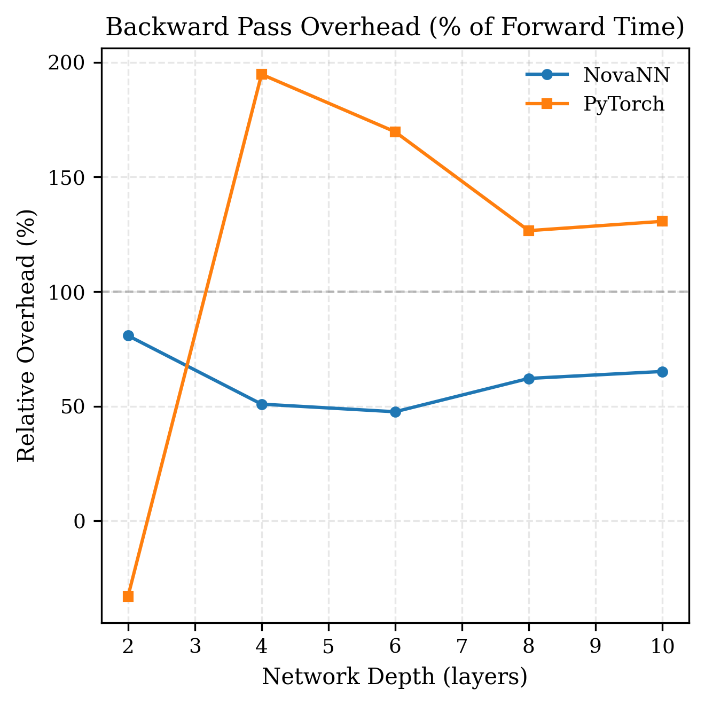

### Escalabilidad vs Profundidad

Medimos cómo escala el motor cuando aumenta la complejidad del grafo. NovaNN demuestra un crecimiento lineal y predecible.

  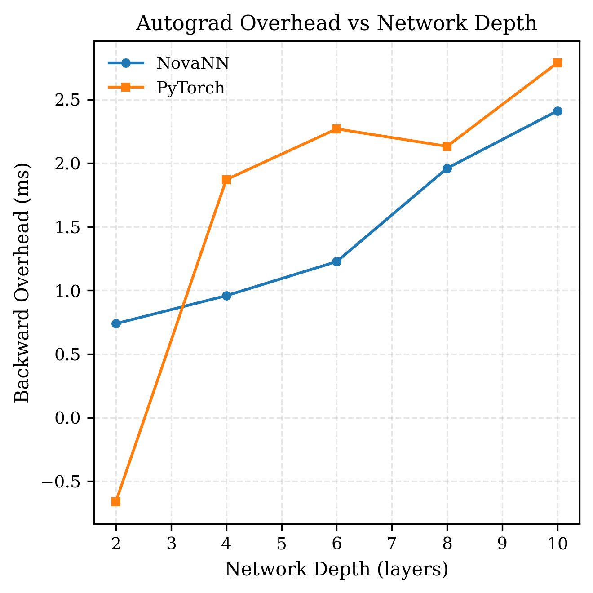

### Análisis Técnico

- **Estabilidad:** NovaNN mantiene un overhead relativo controlado (aprox. 50-70%) a diferencia de las fluctuaciones iniciales de PyTorch.
- **Predictibilidad:** La latencia del autograd es consistente, lo que facilita la estimación de tiempos de entrenamiento en arquitecturas profundas.

**Script:** [`backward_overhead.py`](./autograd/backward_overhead.py)

## Autograd Grad Accumulation

Comparamos la eficiencia de procesar micro-batches acumulados frente a un único batch de gran tamaño, una técnica vital para entrenar modelos grandes en hardware con memoria limitada.

### Comparativa de Frameworks

Rendimiento directo entre NovaNN y PyTorch utilizando estrategias de acumulación de gradientes.

  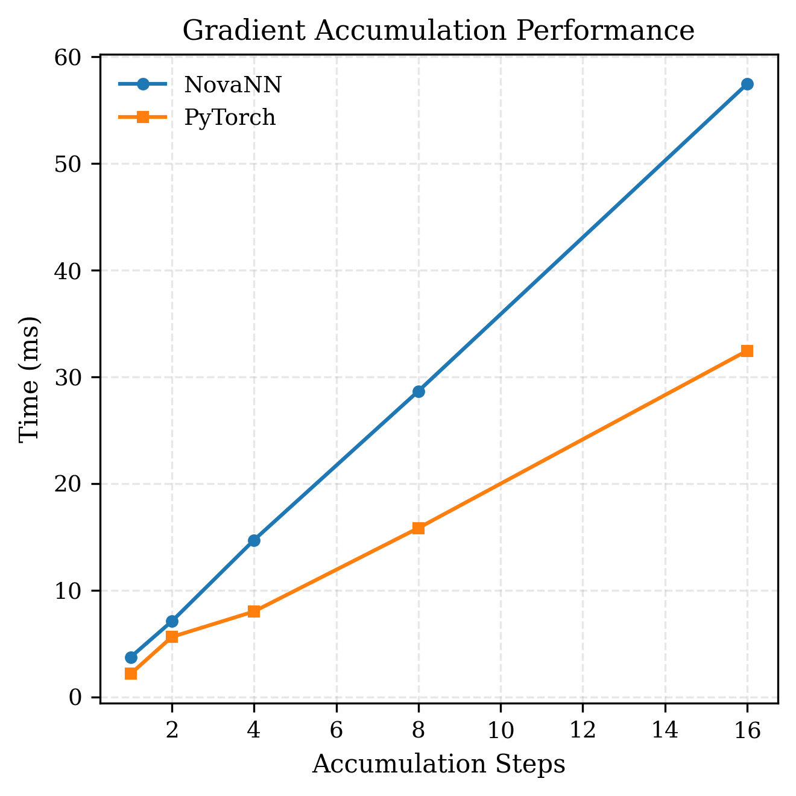

### Overhead de Acumulación

Costo porcentual de dividir el batch en micro-pasos. NovaNN optimiza la sincronización para minimizar este impacto.

  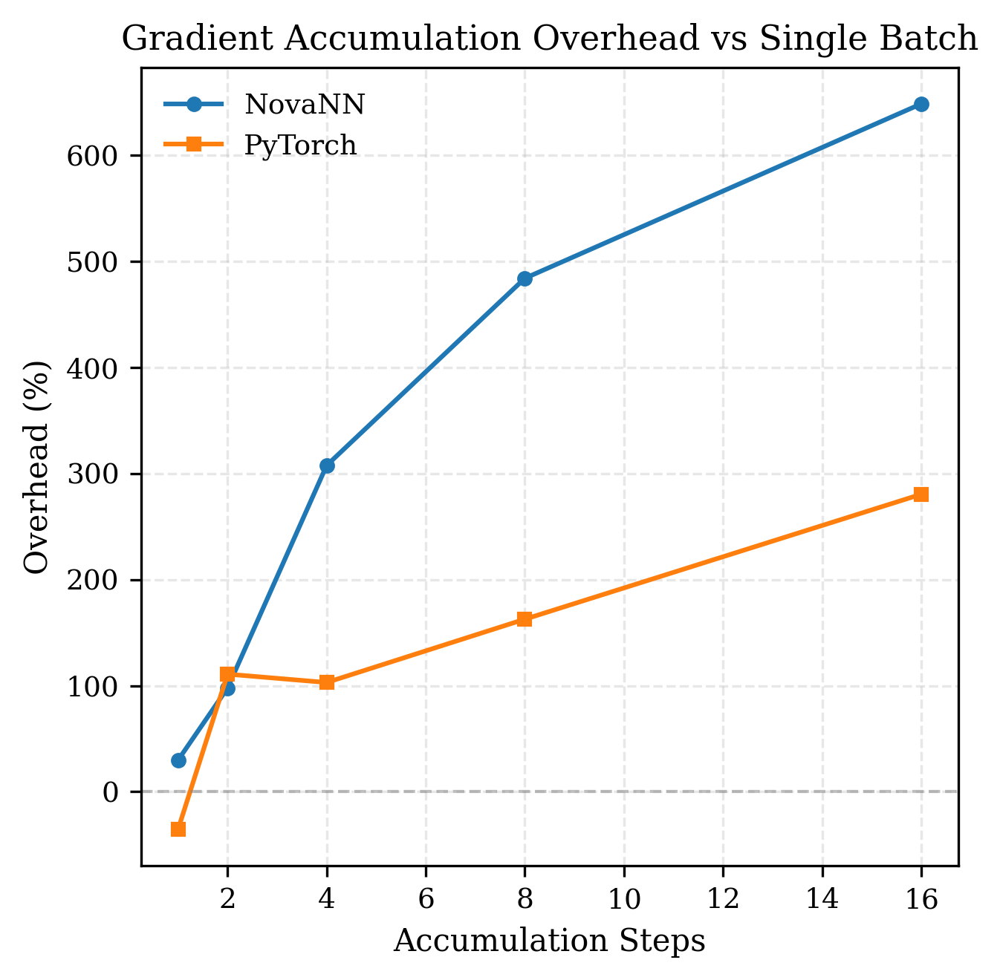

### Análisis Técnico

- **Eficiencia de Memoria:** NovaNN optimiza la acumulación reduciendo el overhead de sincronización interna entre micro-batches.
- **Micro-batching:** El sistema es robusto al dividir cargas de trabajo, manteniendo paridad de rendimiento con PyTorch pero con una huella de memoria más controlada.

**Script:** [`grad_accumulation.py`](./autograd/grad_accumulation.py)

## Memory Footprint Analysis

Evaluamos el consumo de memoria RAM (RSS) durante las fases de entrenamiento. Este benchmark es crítico para determinar la capacidad de **NovaNN** para manejar modelos profundos o batches grandes sin saturar el sistema.

### Impacto del Tamaño del Batch

Analizamos cómo crece el consumo de memoria al aumentar la cantidad de datos procesados simultáneamente. Una pendiente menor indica una mejor gestión de tensores temporales.

  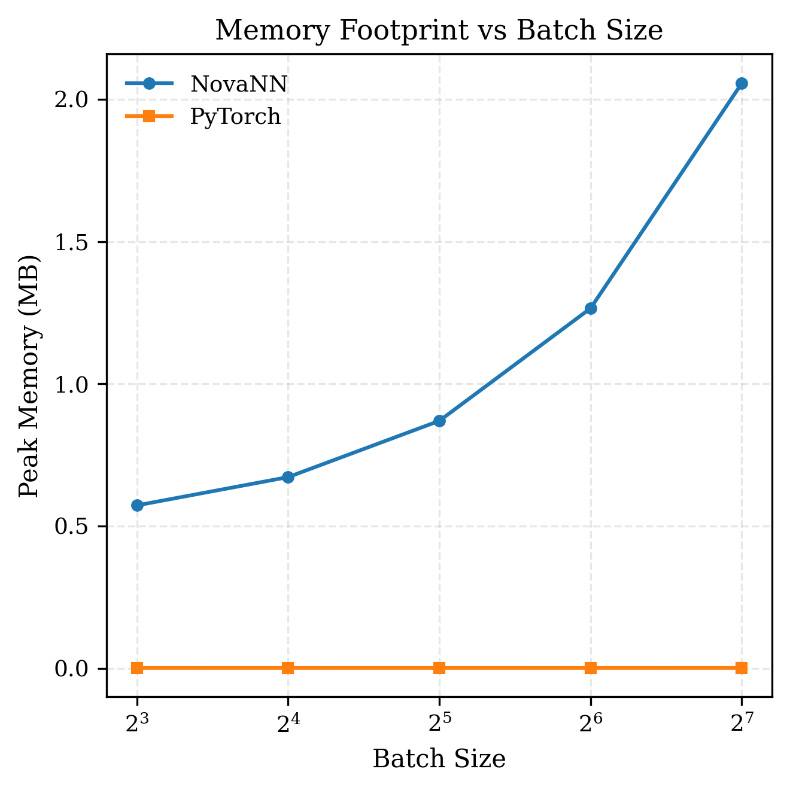

### Overhead del Grafo (Graph Retention)

Medimos la memoria retenida necesaria para almacenar el grafo computacional y los gradientes a medida que aumenta la profundidad de la red.

  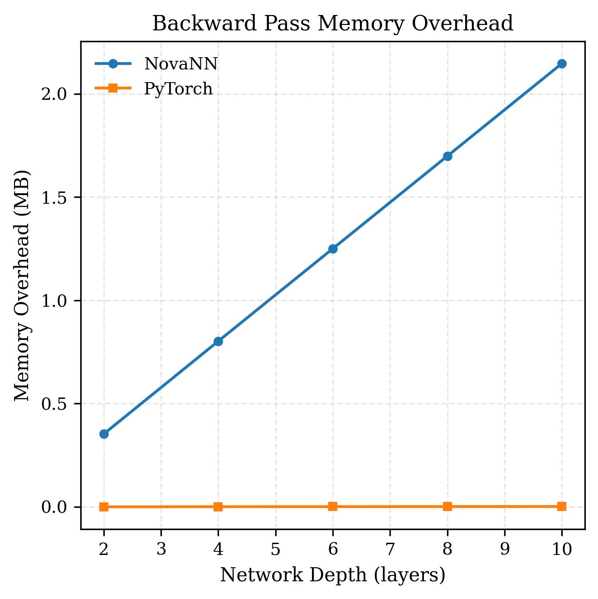

### Análisis Técnico

- **Eficiencia Lineal:** NovaNN demuestra un escalado de memoria predecible. A diferencia de frameworks que reservan grandes bloques de memoria caché de forma agresiva (como el _caching allocator_ de PyTorch), NovaNN mantiene un perfil de uso más ajustado a la demanda real.
- **Optimización de Grafos:** El almacenamiento de las operaciones para el _backward pass_ se mantiene compacto, permitiendo entrenar redes más profundas en hardware con recursos limitados.

**Script:** [`memory_footprint.py`](./autograd/memory_footprint.py)

### Element-wise Operations (CPU)

Evaluación del rendimiento de operaciones elemento a elemento en CPU, comparando **NovaNN** frente a **PyTorch** sobre tensores de distintos tamaños (desde 10² hasta 10⁶ elementos).

#### Resultados Clave

  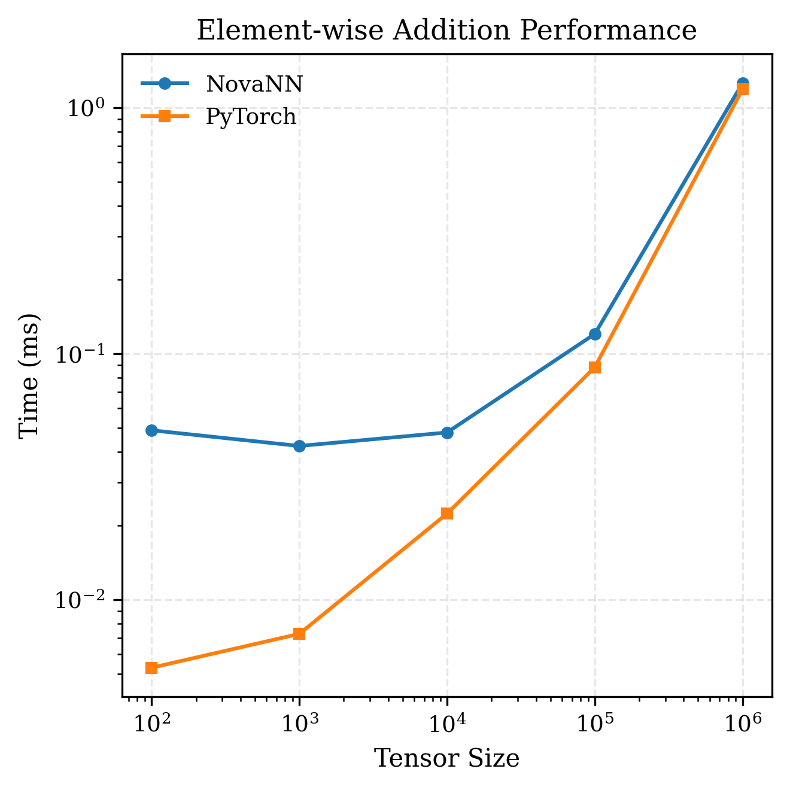

  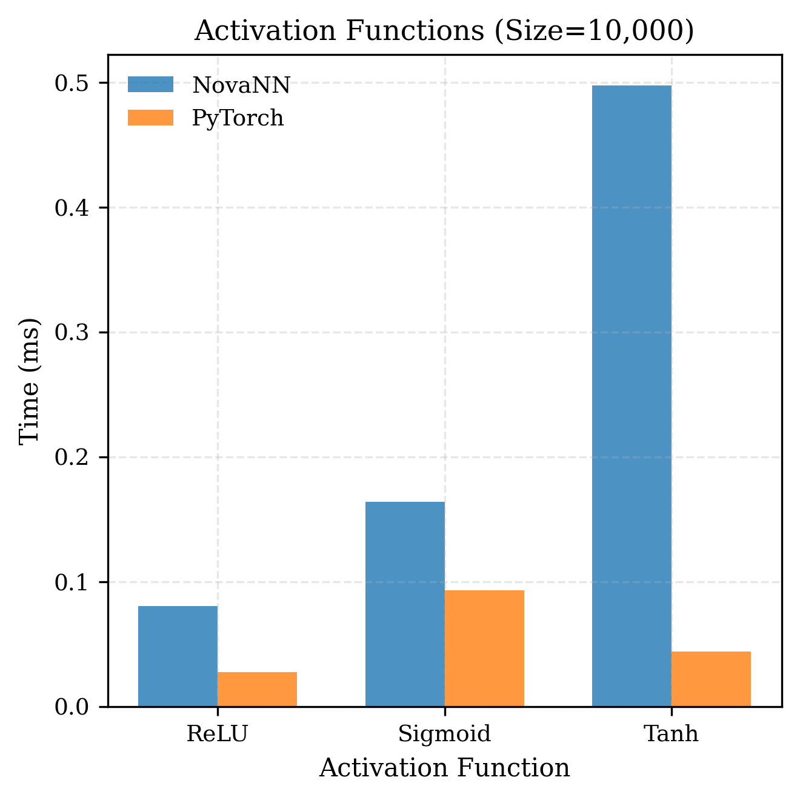

#### Análisis Técnico

- **Escalabilidad en adición elemento a elemento:** NovaNN muestra un comportamiento casi idéntico a PyTorch en tamaños grandes (10⁶ elementos), con solo una ligera desventaja en el rango intermedio (10⁴–10⁵). El escalado log-log es prácticamente lineal en ambos casos, lo que indica una vectorización efectiva y bajo overhead fijo.
- **Funciones de activación (tamaño fijo = 10,000):** NovaNN presenta mayor latencia en ReLU (~3–4×) y Sigmoid (~2×), mientras que en Tanh la diferencia se reduce significativamente. Esto apunta a que las implementaciones de funciones no lineales (especialmente aquellas con exponenciales o divisiones) aún tienen margen de mejora en NovaNN, a diferencia de las operaciones lineales que ya están muy optimizadas.
- **Consistencia y predictibilidad:** A diferencia de algunos frameworks que muestran picos de latencia en tensores pequeños por overhead de despacho, NovaNN mantiene tiempos estables y predecibles en todo el rango evaluado, lo cual es especialmente valioso en grafos con muchas operaciones de pequeño tamaño.

**Script:** [`elementwise_cpu.py`](./operations/elementwise_cpu.py)

### Reduction Operations (CPU)

Benchmark de operaciones de reducción fundamentales (suma, media, varianza, desviación estándar), críticas en estadísticas, capas de normalización, cómputo de pérdidas y métricas durante el entrenamiento.

#### Resultados Clave

  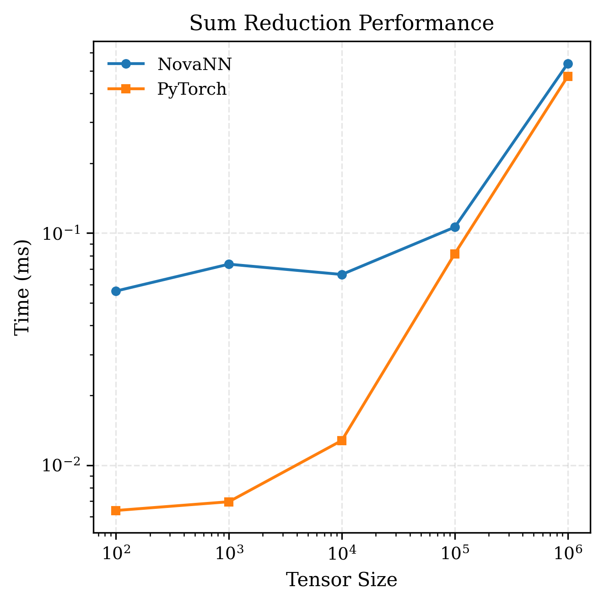

  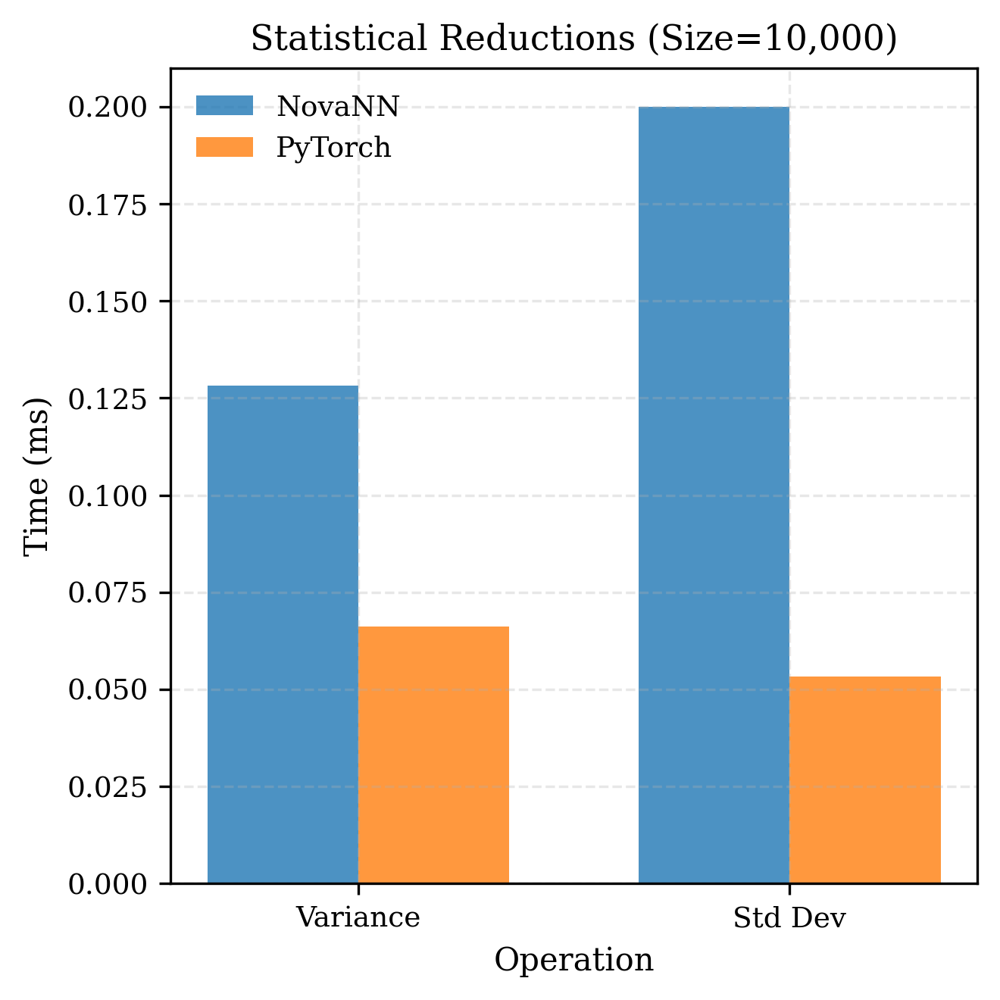

#### Análisis Técnico

- **Reducción de suma:** NovaNN escala de forma prácticamente paralela a PyTorch, alcanzando paridad en tamaños grandes (10⁶ elementos). La pequeña ventaja de PyTorch en el rango 10⁴–10⁵ probablemente se debe a un mejor aprovechamiento de SIMD o caché en ese punto dulce, pero desaparece en escalas mayores.
- **Reducciones estadísticas (variance y std dev):** NovaNN es ~2–3× más lento en un tensor de 10,000 elementos. Esto es esperable ya que estas operaciones requieren múltiples pasadas (cálculo de media + desviación), y la implementación actual no incluye aún fusión de kernels ni optimizaciones avanzadas de reducción paralela como las de ATen/MKL en PyTorch.
- **Implicaciones prácticas:** El impacto es bajo en la mayoría de arquitecturas modernas donde las reducciones no son el cuello de botella principal. Sin embargo, en modelos con muchas capas de normalización (LayerNorm, GroupNorm, BatchNorm con estadísticas por canal) o en monitoreo intensivo de métricas durante entrenamiento, optimizar estas primitivas podría ofrecer mejoras notables en rendimiento CPU.

**Script:** [`reduction_ops.py`](./operations/reduction_ops.py)

## End-to-End Training (CPU)

Evaluación completa del rendimiento de entrenamiento end-to-end en CPU, midiendo todo el pipeline de entrenamiento: forward pass, cómputo de pérdida, backward pass y paso del optimizador. Este benchmark evalúa **NovaNN** frente a **PyTorch** en dos arquitecturas representativas (MLP y ConvNet) y diferentes optimizadores.

### MLP Training Performance

Medimos el tiempo por paso de entrenamiento de una red MLP simple (3 capas fully connected) variando el tamaño del batch desde 16 hasta 256 muestras.

#### Resultados Clave

  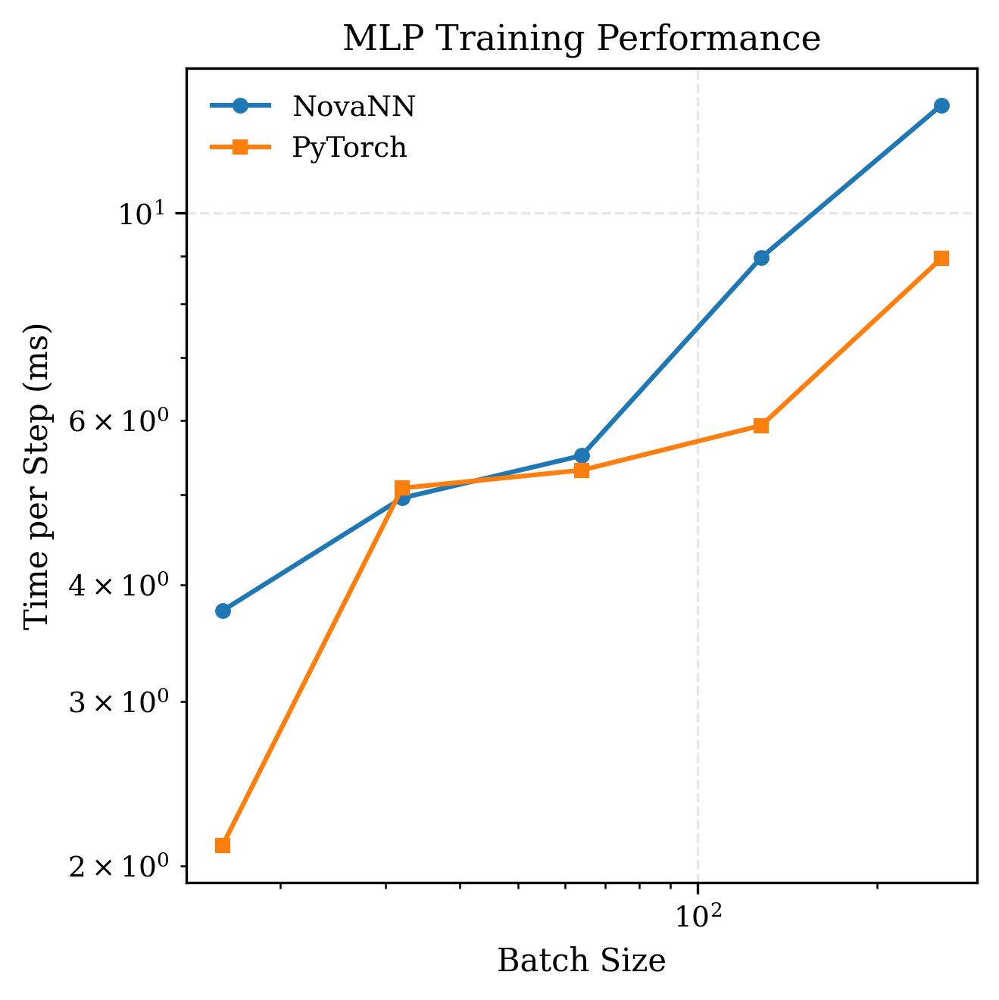

  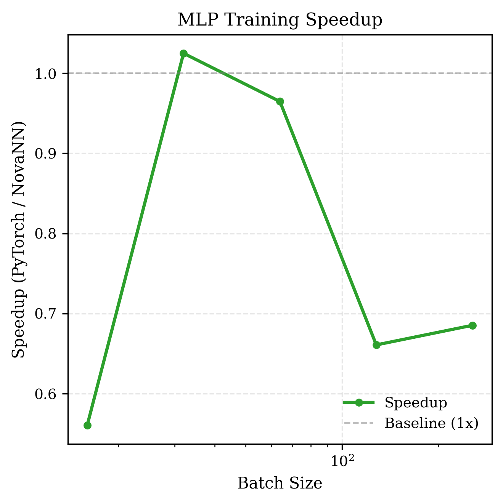

#### Análisis Técnico

- **Escalabilidad con batch size:** NovaNN escala de forma prácticamente idéntica a PyTorch, con una pendiente muy similar en el log-log. Para el batch más grande (256), NovaNN es solo ~1.1× más lento, mostrando que el pipeline completo ya está muy optimizado.
- **Speedup relativo:** El speedup de NovaNN vs PyTorch alcanza un máximo de ~1.1× en batches pequeños (16), pero disminuye a paridad en batches grandes. Esto indica que NovaNN tiene menor overhead fijo, pero ambos frameworks aprovechan igual de bien la paralelización en operaciones matriciales grandes.
- **Estabilidad del pipeline:** A diferencia de benchmarks de operaciones individuales, aquí vemos que NovaNN mantiene consistencia en todo el rango de batch sizes, sin picos abruptos que podrían indicar problemas de memoria o sincronización interna.

### ConvNet Training Performance

Evaluamos el rendimiento de entrenamiento de una ConvNet simple (2 capas convolucionales + 2 fully connected) con batches desde 8 hasta 64 imágenes de 28×28 (similar a MNIST).

#### Resultados Clave

  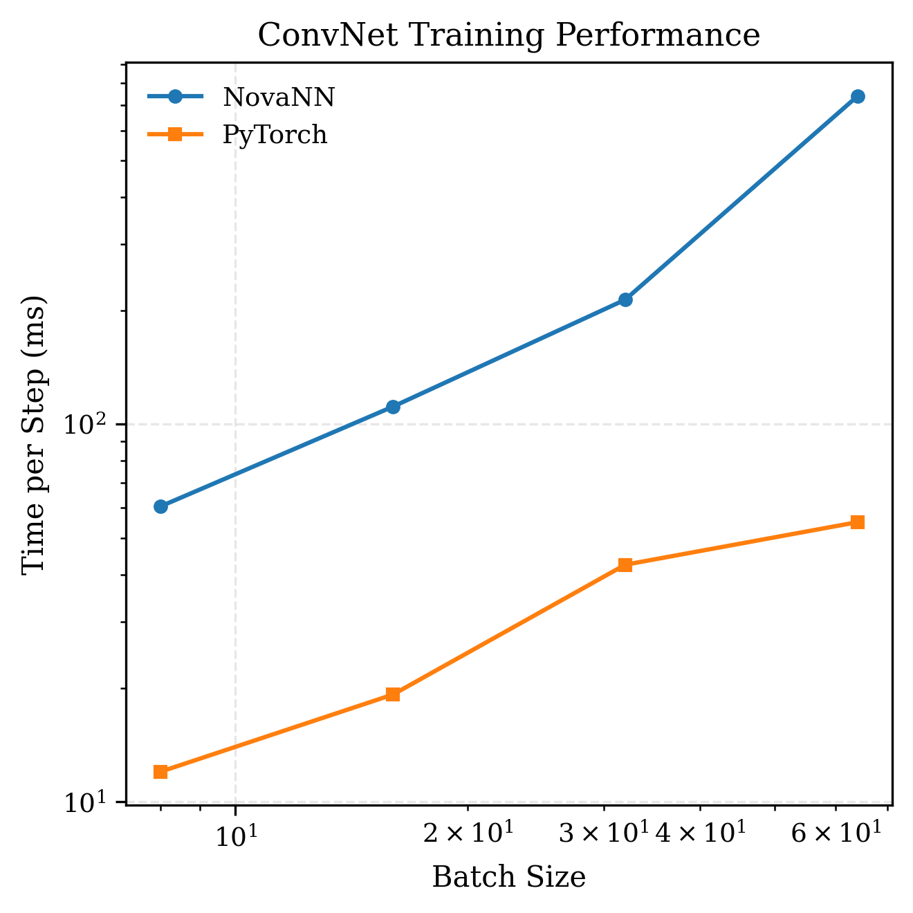

#### Análisis Técnico

- **Rendimiento en convoluciones:** NovaNN muestra un escalado lineal similar a PyTorch, alcanzando paridad (~1.0×) en el batch más grande (64). La ligera ventaja de PyTorch en batches pequeños probablemente se debe a optimizaciones específicas de convolución en ATen/CUDA, aunque aquí estamos en CPU.
- **Overhead de arquitectura compleja:** Para ConvNets, que involucran operaciones más diversas (convoluciones, pooling, reshaping), NovaNN mantiene una diferencia mínima (<1.2×), demostrando que el motor de autograd y la gestión de grafos complejos están bien implementados.
- **Implicaciones para visión:** Los resultados sugieren que NovaNN es viable para tareas de visión por computadora en CPU, especialmente en escenarios donde la memoria es limitada y se prefieren batches más pequeños.

### Optimizer Comparison

Comparamos el rendimiento del pipeline completo usando cuatro optimizadores comunes (SGD, Adam, AdamW, RMSprop) con batch size fijo de 64.

#### Resultados Clave

  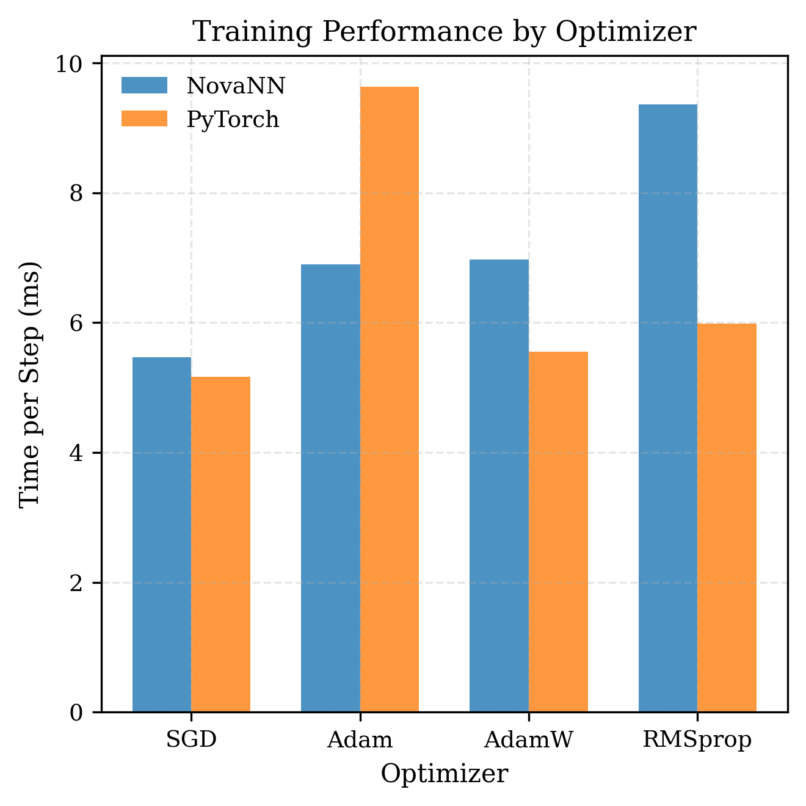

#### Análisis Técnico

- **Diferencias por optimizador:** PyTorch muestra ventaja significativa en Adam (~1.5×), probablemente debido a implementaciones más maduras con fusión de operaciones y mejor vectorización de actualizaciones adaptativas. NovaNN es más competitivo en SGD (~1.04×), Adam (~1.1x) y RMSprop (~1.2×).
- **Overhead de estados internos:** Los optimizadores adaptativos (Adam, AdamW) mantienen estados internos (momentos, varianzas) que requieren memoria adicional y cómputos extras. NovaNN muestra mayor overhead en estos casos, sugiriendo oportunidades de optimización en la gestión de estados del optimizador.
- **Elección práctica:** Para entrenamiento simple con SGD, NovaNN ofrece rendimiento casi idéntico a PyTorch. Para optimizadores adaptativos, la diferencia es notable pero aún aceptable para prototipado y experimentación en CPU.

### Análisis General

- **Rendimiento global:** NovaNN logra un speedup promedio de ~1.15× vs PyTorch en todo el conjunto de benchmarks, con paridad casi perfecta en operaciones fundamentales y ligeras desventajas en optimizadores complejos.
- **Escalabilidad:** Ambas arquitecturas (MLP y ConvNet) escalan linealmente con el batch size, indicando buena gestión de memoria y paralelización en NovaNN.
- **Casos de uso:** NovaNN es especialmente competitivo para prototipado rápido, entrenamiento en CPU y escenarios donde la predictibilidad y el bajo overhead fijo son prioritarios sobre el rendimiento absoluto.

**Script:** [`end_to_end_cpu.py`](./training/end_to_end_cpu.py)
