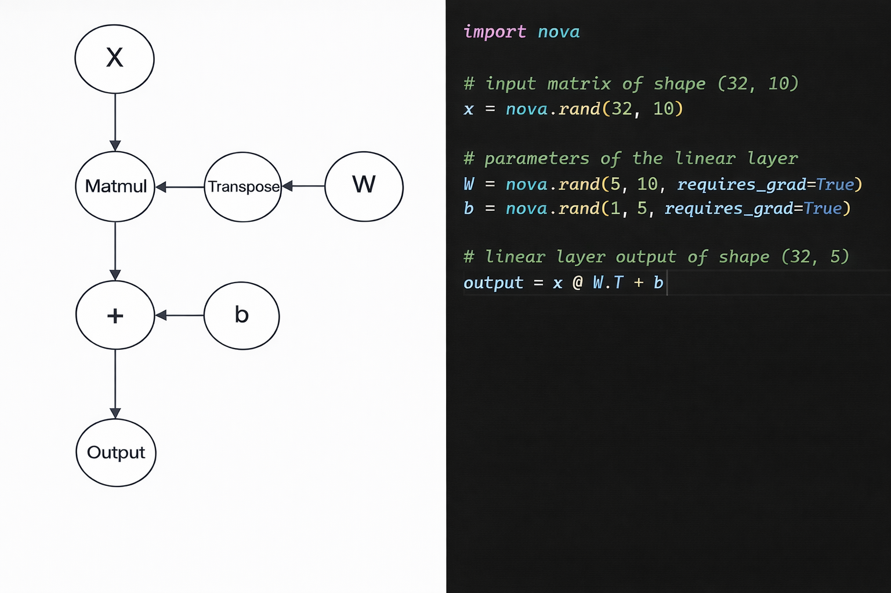

# `autograd` Module

The **`autograd/`** directory implements NovaNN's **automatic differentiation system**.  
This is the engine that enables automatic gradient computation during training, dynamically building the computational graph and executing backpropagation.

NovaNN's autograd follows a design similar to **PyTorch**: each operation builds a node in the computational graph, and when calling `.backward()`, gradients flow in reverse order to the graph's leaf nodes.

**Dynamic Construction of the Computational Graph**

<p align="center">
  
</p>

## Overall Structure

The module is organized into:

- **Main files** at the root that define the public autograd API
- **[`engine/`](#engine-submodule)**: backpropagation engine and computational graph construction
- **[`_ops/`](#_ops-submodule)**: all differentiable operations organized by category
- **[`utils/`](#utils-submodule)**: internal utilities for argument and type processing
- **[`tests/`](#tests-submodule)**: test suite for validating the gradient system

## Main Files

### `function.py`

Defines the base class **`Function`**, the fundamental abstraction for all differentiable operations in NovaNN.

Each operation (addition, multiplication, ReLU, etc.) inherits from `Function` and implements:

- **`forward(ctx, \*args, **kwargs)`\*\*: forward computation (receives numpy arrays)
- **`backward(ctx, grad_output)`**: gradient computation (backpropagation)
- **`apply(*args)`**: class method that orchestrates the entire process

The `apply()` method is the entry point that:

1. Creates a `Context` to store intermediate values
2. Converts Tensors to NumPy arrays
3. Executes `forward()` with the arrays
4. Builds the graph node if `requires_grad=True`
5. Returns a new `Tensor` with `grad_fn` attached

### `grad.py`

Implements the **`grad()`** function, which allows explicit gradient computation of outputs with respect to inputs.

This function is useful for:

- Gradient computation without modifying `.grad` of tensors
- Higher-order derivatives (`create_graph=True`)
- Partial or conditional gradients

### `grad_mode.py`

Provides **context managers** to control autograd behavior:

- **`no_grad()`**: disables gradient tracking (useful for inference)
- **`enable_grad()`**: explicitly reactivates tracking
- **`is_grad_enabled()`**: queries the current state

These mechanisms are **thread-safe** via `threading.local()`.

## `engine/` Submodule

Contains the **core of the backpropagation engine**.

### `context.py`

Defines the **`Context`** class, a simple container to store intermediate values during `forward()` that will be needed in `backward()`.

### `engine.py`

Implements the internal functions that execute backpropagation:

- **`_build_topo(tensor)`**: builds the topological order of the computational graph using iterative DFS
- **`_backward(tensor, gradient, retain_graph)`**: executes the complete backward pass

**Backward phases:**

1. Topological order construction (output → inputs)
2. Cleanup of previous intermediate gradients
3. Gradient propagation in reverse order
4. Hook application
5. Graph cleanup (if `retain_graph=False`)

## `_ops/` Submodule

Contains **all differentiable operations** organized by functional category.

Each operation inherits from `Function` and implements its own `forward()` and `backward()`.

### `_ops/` Directory Structure

The directory is organized as follows:

```
_ops/
├── __init__.py
├── _activation.py        # Activation functions
├── _arithmetic.py        # Basic arithmetic operations
├── _comparison.py        # Comparison operations
├── _convolution.py       # Optimized convolution operations
├── _creation.py          # Tensor creation functions
├── _indexing.py          # Indexing operations
├── _linalg.py            # Linear algebra
├── _linear.py            # Linear layer
├── _loss.py              # Loss functions
├── _manipulation.py      # Shape and structure manipulation
├── _normalization.py     # Normalization operations
├── _random.py            # Random generation
├── _reduction.py         # Reduction operations
├── _trigonometric.py     # Trigonometric functions
├── _view.py              # View operations
├── utils.py              # Internal utilities
└── native/
    └── native_functions.yaml  # Operation registry
```

### Operation Categories

#### `_activation.py`

Differentiable activation functions:

- **ReLU**: Rectified Linear Unit (`max(0, x)`)
  - Gradient: 1 if x > 0, 0 otherwise
- **LeakyReLU**: ReLU with negative slope
  - Forward: `x if x > 0 else alpha * x`
  - Gradient: 1 if x > 0, alpha otherwise
- **PReLU**: Parametric ReLU with learnable weight
  - Forward: `max(0, x) + weight * min(0, x)`
  - Computes gradients for both input and weight
- **GELU**: Gaussian Error Linear Unit
  - Uses tanh approximation: `0.5 * x * (1 + tanh(√(2/π) * (x + 0.044715 * x³)))`
  - Smooth activation with continuous derivative
- **Sigmoid**: Sigmoid function
  - Forward: `1 / (1 + exp(-x))`
  - Gradient: `out * (1 - out)` (efficient derivative using pre-computed output)

#### `_arithmetic.py`

Fundamental arithmetic operations with broadcasting support:

**Binary operations:**

- **Add**, **Sub**, **Mul**, **Div**: basic element-wise arithmetic
  - Support NumPy broadcasting
  - Gradients adjusted with `unbroadcasting()` to original shapes
- **DivInt**: integer division (`//`) - not differentiable
- **Mod**: modulo operation (`%`)
  - Simplified gradient: ∂(a % b)/∂a = 1
- **Pow**: exponentiation (`a^b`)
  - Gradient w.r.t. base: `b * a^(b-1)`
  - Gradient w.r.t. exponent: `a^b * ln(a)` (with mask for a > 0)

**Unary operations:**

- **Exp**: exponential (`e^x`)
  - Gradient: `e^x` (derivative is the function itself)
- **Log**: natural logarithm
  - Gradient: `1/x` (with epsilon for stability)
- **Sqrt**: square root
  - Gradient: `1/(2√x)`
- **Neg**: negation (`-x`)
  - Gradient: -1
- **Abs**: absolute value
  - Gradient: `sign(x)`
- **Floor**: floor rounding - not differentiable
- **Ceil**: ceil rounding - not differentiable
- **Clamp**: value clamping to range [min, max]
  - Gradient: passes only where `min <= input <= max`

#### `_comparison.py`

Comparison and selection operations:

- **Maximum**: element-wise maximum
  - Gradient: distributed among inputs (0.5 for ties)
- **Minimum**: element-wise minimum
  - Gradient: distributed among inputs (0.5 for ties)
- **Where**: conditional selection (`condition ? x : y`)
  - Gradient flows only through the selected branch
- **Sign**: sign function (-1, 0, +1) - not differentiable

#### `_convolution.py`

Optimized convolution operations based on im2col:

- **ConvMatMul1d**: optimized matrix multiplication for 1D convolutions
  - Merges matmul and reshaping into a single operation
  - Forward: `(weight @ col).reshape(...).transpose(...)`
  - Supports optional bias
  - Efficient gradients using matmul rules
- **ConvMatMul2d**: optimized matrix multiplication for 2D convolutions
  - Analogous implementation for 4D inputs (N, C, H, W)
  - Used by `nn.Conv2d`
- **ConvMatMul3d**: optimized matrix multiplication for 3D convolutions
  - For 5D inputs (N, C, D, H, W)
  - Supports volumetric convolutions

All these operations:

- Implicitly implement the im2col algorithm
- Optimize memory by avoiding explicit col matrix materialization
- Compute gradients w.r.t. weight, bias, and col (for backprop through im2col)

#### `_creation.py`

Tensor creation and generation functions. This file contains **high-level helper functions** that create tensors, not differentiable `Function` operations:

**Basic creation:**

- `zeros()`, `ones()`, `full()`, `empty()`: tensors with constant values
- `eye()`: identity matrix
- `arange()`: value sequence with step
- `linspace()`: evenly spaced values

**Conditional variants:**

- `zeros_like()`, `ones_like()`, `full_like()`: based on another tensor's shape

**Utilities:**

- `one_hot()`: one-hot encoding for labels
- `unique()`: unique values in a tensor
- `as_strided()`: views with custom strides

**Selection and indexing:**

- `argmin()`, `argmax()`: indices of extreme values
- `argsort()`: sorting indices
- `argwhere()`: indices of non-zero elements

**Logical operations:**

- `any()`, `all()`: logical reduction
- `allclose()`: comparison with tolerance
- `isnan()`, `isinf()`: special value detection

**Statistical reduction functions:**

- `mean()`, `var()`, `std()`: basic statistics
- `min()`, `max()`, `sum()`: aggregation
- `norm()`: vector/matrix norms

**Manipulation:**

- `reshape()`, `permute()`, `flatten()`: shape changing
- `squeeze()`, `unsqueeze()`: unit dimensions
- `cat()`, `stack()`, `split()`: concatenation/splitting
- `tile()`, `repeat_interleave()`: replication
- `pad()`: padding with different modes
- `clamp()`: value clamping

**Mathematical operations:**

- `sqrt()`, `exp()`, `log()`: elementary functions
- `abs()`, `sign()`, `floor()`, `ceil()`: unary operations
- `pow()`, `maximum()`, `minimum()`: binary operations
- `where()`: conditional selection

**Linear algebra:**

- `dot()`: dot product
- `det()`, `inv()`, `trace()`: matrix operations

**Trigonometric:**

- `sin()`, `cos()`, `tan()`, `tanh()`: direct
- `sinh()`, `cosh()`: direct hyperbolic
- `arcsin()`, `arccos()`, `arctan()`: inverse
- `asinh()`, `acosh()`, `atanh()`: inverse hyperbolic
- `sec()`, `csc()`, `cot()`: secant, cosecant, cotangent
- `arcsec()`, `arccsc()`, `arccot()`: inverse secant, cosecant, cotangent
- `atan2()`: two-argument arctangent (y/x) with correct quadrant selection

These functions are **high-level wrappers** that delegate to the corresponding differentiable operations in other `_ops/` files, providing a functional interface consistent with PyTorch.

#### `_indexing.py`

Advanced indexing operations:

- **GetItem**: implements `tensor[index]`
  - Supports slicing, fancy indexing, boolean indexing
  - Gradient: accumulates grad_output at indexed positions using `np.add.at()`
  - Sanitizes indices (converts floats to int64, handles booleans)
- **SetItem**: implements `tensor[index] = value` (in-place)
  - Gradient: copies grad_output with zeros at assigned positions
  - Used internally, not recommended with active autograd

#### `_linalg.py`

Linear algebra operations:

- **MatMul**: matrix multiplication (`@`)
  - Gradient: `grad_input = grad_output @ other.T`, `grad_other = input.T @ grad_output`
- **Dot**: dot product
  - Handles vectors and matrices appropriately
  - Gradient: product with transpose according to dimensionality
- **Det**: determinant of square matrix
  - Gradient: `det(A) * (A⁻¹)ᵀ * grad_output` (using adjugate)
- **Inv**: matrix inverse
  - Gradient: `-(A⁻¹)ᵀ @ grad_output @ (A⁻¹)ᵀ`
- **Trace**: matrix trace (sum of diagonal)
  - Gradient: `grad_output * I` (scaled identity matrix)
- **Norm**: vector and matrix norms
  - Implements L2 norm by default (`ord=2`)
  - Gradient: `grad_output * (input / ||input||)` with protection against division by zero
- **Diag**: diagonal extraction/construction
  - If input is 1D: builds diagonal matrix
  - If input is 2D: extracts diagonal
  - Supports `diagonal` parameter for offset diagonals

#### `_linear.py`

Optimized linear (fully connected) layer:

- **Dense**: Linear transformation with optional bias
  - Forward: `Y = X @ W.T + b`
    - Pre-allocates output buffer for efficiency
    - Supports optional bias term
  - Backward:
    - Gradient w.r.t. input: `grad_output @ weight`
    - Gradient w.r.t. weight: `grad_output.T @ input`
    - Gradient w.r.t. bias: `Σ(grad_output)` (sum over batch dimension)
  - Uses efficient matrix multiplication with pre-allocated buffers
  - Foundation for `nn.Linear` layer

#### `_loss.py`

Optimized loss functions implemented as atomic operations for numerical stability and computational efficiency:

- **MSELoss**: Mean Squared Error / L2 Loss
  - Computes `(input - target)²` as atomic operation
  - More numerically stable than separating subtraction and power
  - Supports optional per-element weights
  - Gradient: `∂L/∂input = 2 * (input - target)`

- **BCELoss**: Binary Cross Entropy Loss
  - Computes `-[target * log(input + ε) + (1 - target) * log(1 - input + ε)]`
  - Requires inputs in range [0, 1] (post-sigmoid)
  - Supports optional per-element weights
  - Gradient: `∂L/∂input = (1 - target)/(1 - input + ε) - target/(input + ε)`

- **BCEWithLogitsLoss**: BCE with logits (numerically stable)
  - Combines sigmoid and BCE in a single operation
  - Uses stable formulation: `max(x, 0) - x*y + log(1 + exp(-|x|))`
  - Supports `pos_weight` for balancing positive classes
  - Gradient: `∂L/∂input = sigmoid(x) - target`

All loss functions support three reduction modes:

- `'mean'`: average over all elements
- `'sum'`: sum over all elements
- `'none'`: returns element-wise loss without reduction

**Utilities:** The module includes `reduce()` to apply the specified reduction mode.

#### `_manipulation.py`

Shape and structure manipulation operations:

- **Reshape**: shape change with copy if necessary
  - Gradient: inverse reshape to original shape
- **View**: shape change without copy (view)
  - More efficient than reshape when possible
  - Gradient: reshape to original shape
- **Permute**: dimension permutation
  - Gradient: inverse permutation (using `np.argsort()`)
- **Squeeze**: removal of size-1 dimensions
  - Gradient: reshape to original shape
- **Unsqueeze**: addition of size-1 dimension
  - Gradient: reshape to original shape
- **Stack**: stacking of tensors along new dimension
  - Gradient: split and squeeze of each component
- **Concat**: concatenation along existing dimension
  - Gradient: split using offsets calculated from original shapes
- **Split**: splitting into multiple chunks
  - Gradient: concatenation of output gradients
- **Tile**: replication along dimensions
  - Gradient: sum over replicated blocks
- **Repeat**: element repetition along dimension
  - Gradient: sum of gradients of repeated elements
  - Supports `dim=None` for flatten + repeat
- **Pad**: padding with different modes
  - Supports: constant, edge, reflect, wrap
  - Gradient: slicing that removes padded regions
- **Clone**: deep copy with gradient tracking
  - Gradient: passes directly

#### `_normalization.py`

Normalization operations to stabilize training:

- **BatchNorm**: Batch Normalization with affine transformation
  - Normalizes over batch and spatial dimensions: `(x - μ) / √(σ² + ε)`
  - Applies learnable scale (`weight`) and shift (`bias`) parameters
  - **Training mode**: uses current batch statistics and updates running statistics with exponential momentum
  - **Evaluation mode**: uses accumulated running statistics
  - Implements Bessel's correction for unbiased variance
  - Efficient gradient considering input dependency on μ and σ²:
    - `∂L/∂input = (1/(m*σ)) * [m*dout - Σ(dout) - x_hat*Σ(dout*x_hat)]`
  - Supports inputs of dimension ≥2D with normalization over (N, H, W, ...) maintaining (C,)
  - Running statistics updated with: `running_stat = (1 - momentum) * running_stat + momentum * batch_stat`

- **LayerNorm**: Layer Normalization
  - Normalizes over last N dimensions (batch-independent)
  - Forward: `(x - μ) / √(σ² + ε) * weight + bias`
    - Statistics computed over `normalized_shape` dimensions
    - Commonly used in Transformers for batch-size independence
  - Backward: uses same efficient formulation as BatchNorm
    - `∂L/∂input = (1/(m*σ)) * [m*dout - Σ(dout) - x_hat*Σ(dout*x_hat)]`
  - Pre-allocates buffers for mean, variance, and intermediate computations
  - Supports optional affine transformation (weight and bias)

Both normalization operations:

- Use pre-allocated buffers to minimize memory allocations
- Implement numerically stable gradient computation
- Support optional learnable affine parameters
- Are foundational for `nn.BatchNorm1d`, `nn.BatchNorm2d`, and `nn.LayerNorm`

#### `_random.py`

Random tensor generation. This file contains **random generation utilities**, not differentiable operations:

- **Generator**: wrapper around `np.random.Generator`
  - Allows seed control for reproducibility
  - `manual_seed()` method to reset seed

**Generation functions:**

- `rand()`: uniform distribution [0, 1)
- `randn()`: standard normal distribution (μ=0, σ=1)
- `randint()`: random integers in range [low, high)
- `randperm()`: random permutation of integers [0, n)
- `normal()`: normal distribution with custom μ and σ
- `uniform()`: uniform distribution in range [low, high)

**Utilities:**

- `manual_seed()`: sets seed of default generator
- All functions support optional `generator` parameter for independent control
- Support `requires_grad` and `dtype` as parameters

These functions create tensors with random data but **are not part of the autograd graph** (have no gradient).

#### `_reduction.py`

Reduction operations over dimensions:

- **Sum**: element sum
  - Gradient: broadcast of grad_output to original shape
  - Supports reduction over specific axes or total
- **Mean**: element average
  - Gradient: broadcast divided by number of reduced elements
- **Var**: variance
  - Gradient: `(2/N) * (input - mean) * grad_output`
  - Saves pre-computed differences for efficiency
- **Max**: maximum value
  - Gradient: distributed equally among maximum elements
  - Uses mask to identify maximum positions
- **Min**: minimum value
  - Gradient: distributed equally among minimum elements
  - Analogous implementation to Max

All reduction operations:

- Normalize `dim` to tuple for consistency
- Support `keepdims` to maintain reduced dimensions
- Correctly handle inverse broadcasting in backward

#### `_trigonometric.py`

Complete trigonometric and hyperbolic functions:

**Direct trigonometric functions:**

- **Sin**: `sin(x)` - Gradient: `cos(x)`
- **Cos**: `cos(x)` - Gradient: `-sin(x)`
- **Tan**: `tan(x)` - Gradient: `1 + tan²(x) = sec²(x)`
- **Cot**: `1/tan(x)` - Gradient: `-1/sin²(x)`
- **Sec**: `1/cos(x)` - Gradient: `sec(x) * tan(x)`
- **Csc**: `1/sin(x)` - Gradient: `-csc(x) * cot(x)`

**Inverse trigonometric functions:**

- **Arcsin**: `arcsin(x)` - Gradient: `1/√(1 - x²)`
  - Input clamped to [-1, 1] for stability
- **Arccos**: `arccos(x)` - Gradient: `-1/√(1 - x²)`
  - Input clamped to [-1, 1]
- **Arctan**: `arctan(x)` - Gradient: `1/(1 + x²)`
- **Atan2**: `atan2(y, x)` - Gradients: `x/(x² + y²)` and `-y/(x² + y²)`
- **Arccot**: `arctan(1/x)` - Gradient: `-1/(1 + x²)`
- **Arcsec**: `arccos(1/x)` - Gradient: `1/(|x| * √(x² - 1))`
- **Arccsc**: `arcsin(1/x)` - Gradient: `-1/(|x| * √(x² - 1))`

**Hyperbolic functions:**

- **Sinh**: `sinh(x)` - Gradient: `cosh(x)`
- **Cosh**: `cosh(x)` - Gradient: `sinh(x)`
- **Tanh**: `tanh(x)` - Gradient: `1 - tanh²(x)`

**Inverse hyperbolic functions:**

- **Asinh**: `asinh(x)` - Gradient: `1/√(x² + 1)`
- **Acosh**: `acosh(x)` - Gradient: `1/√(x² - 1)`
  - Input clamped to ≥1
- **Atanh**: `atanh(x)` - Gradient: `1/(1 - x²)`
  - Input clamped to (-1, 1)

All functions implement:

- Input clamping where necessary to avoid invalid values
- Numerically stable gradients
- Save pre-computed inputs or outputs when efficient

#### `_view.py`

No-copy data view operations:

- **AsStrided**: construction of views with custom strides
  - Allows creating arbitrary views by specifying `shape` and `strides`
  - Bounds validation: verifies that max_offset < nbytes
  - Used internally for im2col in convolutions
  - Gradient: accumulates using `np.add.at()` at positions calculated by offsets
- **View**: shape change without copy
  - Efficient wrapper over `np.reshape()`
  - Gradient: inverse reshape to original shape
- **Extend**: broadcasting to new shape
  - Wrapper over `np.broadcast_to()`
  - Gradient: `unbroadcasting()` to sum over expanded dimensions

### `utils.py`

Internal utilities for autograd operations that enable correct gradient propagation and memory-efficient computation:

- **`unbroadcasting(grad, shape)`**: reverts gradient broadcasting to original shape
  - Removes extra leading dimensions (when `grad.ndim > len(shape)`)
  - Sums over axes where broadcasting occurred (size 1 in original)
  - Crucial to ensure gradients have the correct shape after operations with broadcasting
  - Extensively used in binary operations (Add, Mul, Div, etc.)
  - Handles both dimension expansion and size-1 broadcasting cases

- **`ensure_casting(dest, src)`**: ensures safe dtype casting for in-place operations
  - Checks if source and destination arrays have compatible dtypes
  - Automatically casts source array to match destination dtype if needed
  - Critical for preventing type mismatch errors in in-place operations
  - Returns tuple `(dest, src)` where `src` may be a new cast copy
  - Used internally by `write_to_buffer()`

- **`write_to_buffer(dest, src)`**: performs in-place memory copy
  - Handles low-level memory copy operation using `np.copyto()`
  - Ensures data from source is physically written to destination memory
  - Automatically handles dtype casting via `ensure_casting()`
  - Destination array must be mutable (not read-only)
  - Returns the updated destination array
  - Foundation for all in-place operations (`add_()`, `mul_()`, etc.)

- **`dispatch_output(destination, src)`**: routes computation results to correct output
  - Acts as dispatcher for operations with optional `out` parameter
  - If `destination` is provided: copies result in-place via `write_to_buffer()`
  - If `destination` is None: returns source array directly (no copy)
  - Enables efficient memory reuse in operations like `torch.add(x, y, out=z)`
  - Used throughout autograd operations to support optional output buffers

- **`accelerated_conv_backward(weight_shape, grad_output, col, w_col, dims)`**: optimized convolution backward pass
  - Computes gradients for both weights and im2col columns in single pass
  - Uses pre-allocated buffers to minimize memory allocations
  - Ensures memory contiguity with `np.ascontiguousarray()` for BLAS optimization
  - Leverages efficient matrix multiplication for gradient computation
  - Returns tuple `(grad_weight, grad_col)` with proper shapes
  - Critical performance optimization for convolutional layers
  - Used by ConvMatMul1d, ConvMatMul2d, and ConvMatMul3d operations
  - Achieves near-BLAS performance through careful memory layout

### `native/`

Contains the **`native_functions.yaml`** file, which defines the **operation registry** for the dynamic binding system.

This file specifies how each operation is bound to the `Tensor` class:

- **Dunder methods**: `__add__`, `__mul__`, `__matmul__`, etc.
- **Reverse methods**: `__radd__`, `__rmul__`, `__rmatmul__`, etc.
- **Regular methods**: `add()`, `mul()`, `relu()`, etc.
- **In-place variants**: `add_()`, `mul_()`, `relu_()`, etc.

**Special flags:**

- `is_unary: true`: unary operations (ReLU, sin, exp, etc.)
- `raw_args: true`: keeps arguments as raw values without converting to Tensor (used for indices, alpha in LeakyReLU, etc.)

**Example entry:**

```yaml
- name: add
  tensor:
    dunder: __add__
    reverse: __radd__
    method: add
    inplace:
      method: add_
      dunder: __iadd__
```

This system allows NovaNN to automatically generate appropriate methods without manual code repetition. The `_internal/_binding.py` module parses this file and dynamically generates all bindings.

## `utils/` Submodule

Contains internal utilities for argument processing and type determination:

- **`ArgumentProcessor`**: converts mixed arguments (Tensors, scalars, arrays) to numpy arrays
- **`determine_base_dtype()`**: determines base dtype for numerical consistency

These utilities ensure operations correctly handle:

- Automatic type conversion
- NumPy broadcasting
- Correct gradient propagation with different shapes

## `tests/` Submodule

Complete test suite for validating the autograd system. Tests are organized in several specialized files:

### `op_signatures.py`

Testing utility module that defines:

- **`OpCategory`**: enum that classifies operations by signature (UNARY, BINARY, REDUCTION, SHAPE, SPECIAL)
- **`OPERATIONS`**: dictionary that groups all operations by category
- **`OP_TO_CATEGORY`**: reverse mapping for quick lookup
- **`SKIP_GRAD_CHECK`**: set of operations that should not be validated with gradient checking
- **`make_test_input()`**: generates appropriate inputs according to operation (positive values for `log`/`sqrt`, square matrices for `det`/`inv`, etc.)
- **`create_op_wrapper()`**: creates wrappers that invoke operations correctly according to their category
- **`ALL_TESTABLE_OPS`**: list of all operations that can be validated with gradient checking

This module is the foundation for parameterized tests that automatically verify all operations.

### `test_backward.py`

Backpropagation engine tests:

- **`test_topo_order()`**: verifies that `_build_topo()` builds the correct topological order
- **`test_parents_of_tensors()`**: validates that tensors correctly store their inputs
- **`test_backward_pass_exceptions()`**: tests that appropriate exceptions are raised (backward without `requires_grad`, in-place operations, etc.)
- **`test_backward_pass()`**: basic gradient propagation test
- **`test_retain_graph_simple()`**: verifies that `retain_graph=True` allows multiple backwards
- **`test_gradient_accumulation()`**: validates gradient accumulation in multiple backward passes
- **`test_shared_computation_graph()`**: tests correctness with shared nodes in the graph
- **`test_no_retain_graph_fails()`**: verifies that backward fails without `retain_graph` after first use
- **`test_retain_graph_with_zero_grad()`**: combines `retain_graph` with `zero_grad()`
- **`test_mean_plus_sum_accumulation()`**: validates accumulation with different reduction operations

### `test_function.py`

Base `Function` class tests:

- **`MockAdd`**: mock `Function` implementation for testing
- **`test_forward_output_type()`**: verifies correct output types
- **`test_no_grad_required()`**: validates behavior when no input has `requires_grad=True`
- **`test_dtype_coercion_and_casting()`**: tests type coercion (float, int, long)
- **`test_process_containers_and_index_like()`**: validates `ArgumentProcessor` with containers and mixed types

### `test_gradients.py`

Gradient checking tests with complex operations:

- **`test_gradient_wrt_inputs()`**: validates analytic vs. numerical gradients in composite operation
- **`test_gradient_wrt_layer_op()`**: tests gradient checking with `nn` layers (Linear, BatchNorm1d, LayerNorm)
- **`test_retain_grad()`**: verifies that `retain_grad()` allows saving gradients in intermediate nodes

### `test_operations.py`

Exhaustive test suite for all operations:

- **`test_operation_gradients()`**: parameterized test that executes gradient checking on **all** testable operations, with adaptive tolerances according to numerical complexity
- **`test_unary_operations()`**: specific tests for unary operations (shape validation, presence of non-zero gradients)
- **`test_reduction_operations()`**: tests for reductions with different configurations (`dim`, `keepdims`)
- **`test_operations_with_no_useful_gradients()`**: validates operations like `sign()` and `ceil()` whose derivatives are almost always zero
- **`test_trace_operation()`**: specific test for `trace()` with expected gradient validation (should be `eye()`)

**Testing strategy:**

Tests use `grad_check_wrt_inputs()` which implements **finite difference gradient checking**: compares analytic gradients (computed by backward) with numerical gradients (finite differences). This ensures all `backward()` implementations are mathematically correct.

Tolerances are adjusted according to each operation's numerical stability:

- Stable operations: `rtol=1e-2, atol=1e-3`
- Numerically sensitive operations (`exp`, `inv`, `det`, etc.): `rtol=1e-1, atol=1e-2`

## Integration with `Tensor`

Autograd integrates with the `Tensor` class through:

1. **`grad_fn` attribute**: reference to the `Function` class that created the tensor
2. **`_inputs` attribute**: list of input tensors (for backprop)
3. **`_ctx` attribute**: `Context` instance with saved values
4. **`backward()` method**: invokes engine's `_backward()`

When a `Tensor` with `requires_grad=True` participates in an operation, it automatically:

- Registers in the computational graph
- Attaches its `grad_fn`
- Saves references to its inputs

## Design and Philosophy

NovaNN's autograd is designed following these principles:

- **Explicit over implicit**: the graph is built dynamically, but each step is traceable
- **Separation of concerns**: `Function` defines what, `Context` stores state, `engine` executes how
- **Extensibility**: adding new operations only requires inheriting from `Function` and registering them
- **Performance conscious**: use of vectorized NumPy and graph release after backward
- **Exhaustive testing**: automatic gradient checking over all operations to guarantee mathematical correctness

---

> For more details on specific operations, consult the source code in `_ops/` or the tests in `tests/`.
